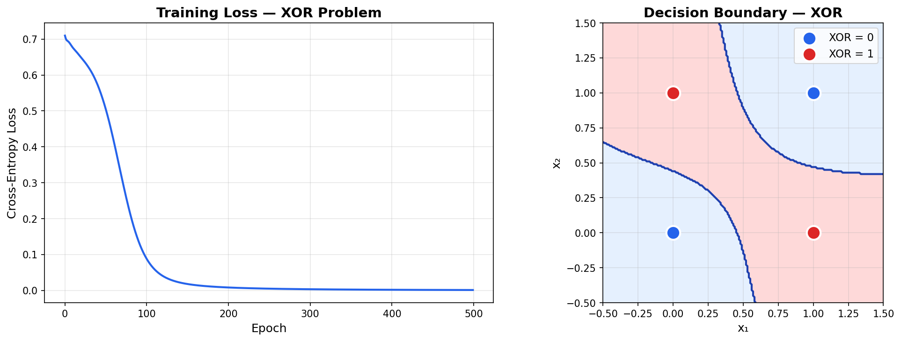
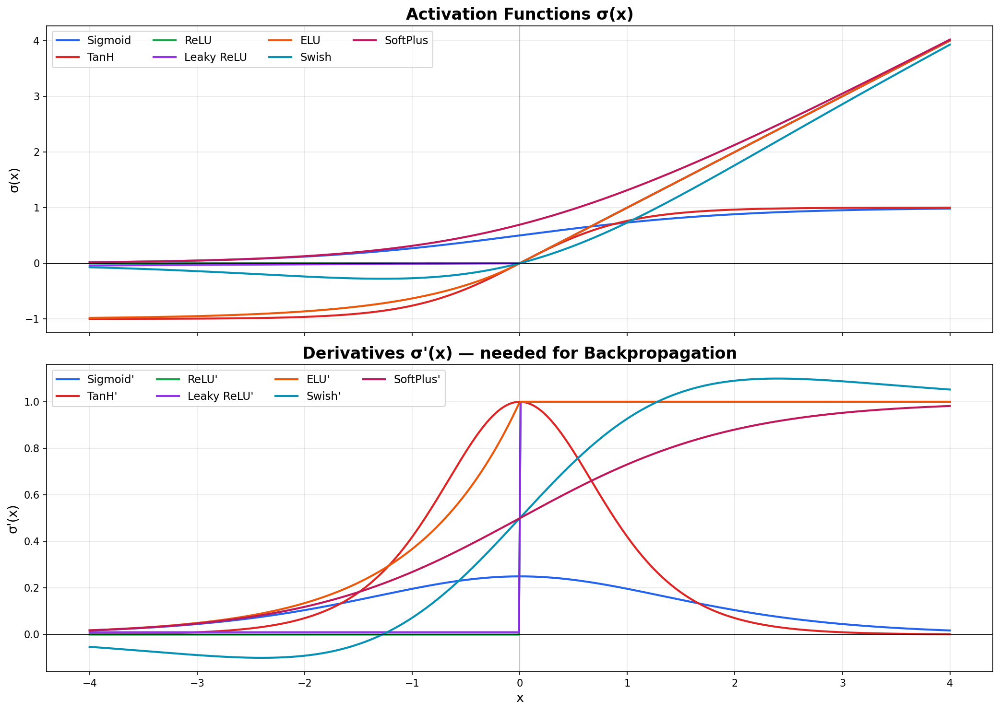
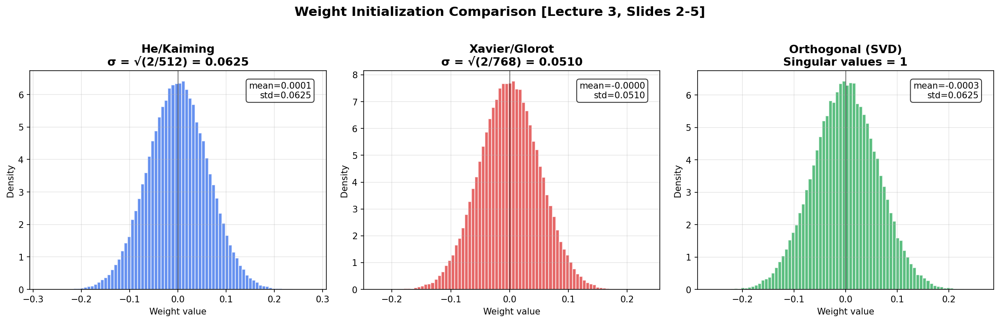
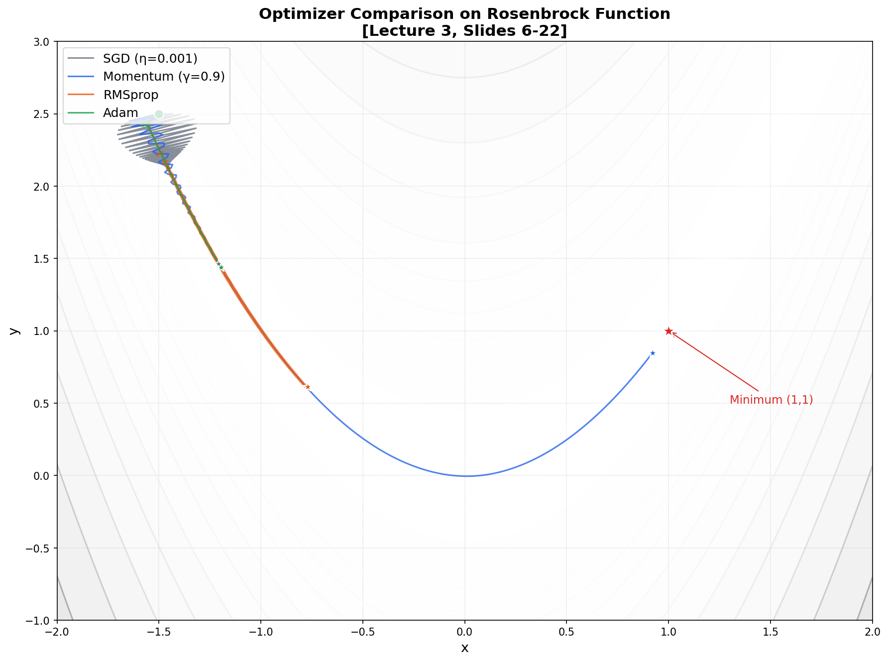

# 🧠 Feedforward Neural Network from Scratch

> **A complete neural network implementation using only NumPy** — no PyTorch, no TensorFlow.  
> Achieves **~97% accuracy on MNIST** handwritten digit classification.

Built as part of a deep-dive into the mathematics behind neural networks, based on the **Advanced Machine Learning** course at [TU Hamburg](https://www.tuhh.de) (Prof. Zemke, WS 2025/26).

---

## 📌 Why This Project?

Most ML tutorials use `model.fit()` and call it a day. This project implements **every component from the ground up** to prove understanding of:

- Forward propagation as a sequence of affine maps + activations
- Backpropagation via the chain rule
- Gradient descent variants (SGD, Momentum, Adam)
- Regularization techniques (L2, Dropout)
- Weight initialization strategies (He, Xavier, Orthogonal)

**Zero frameworks. Pure math. Pure NumPy.**

---

## 🏗️ Architecture

The network implements the standard feedforward evaluation from Lecture 1:

```
a₁ := x                          (input)
zᵢ := Wᵢ · aᵢ + bᵢ              (affine transformation)
aᵢ₊₁ := σ(zᵢ)                   (activation)
f(x) := aₘ                       (output)
```

For MNIST, the architecture is:

```
Input (784) → Dense (256, ReLU) → Dense (128, ReLU) → Output (10, Softmax)
         He init          He init           He init
              Dropout(0.2)       Dropout(0.2)
```

**Total parameters:** 235,146

---

## 📐 Mathematical Foundations

### Forward Pass
Each layer computes an affine map followed by a non-linear activation:

$$z_i = W_i \cdot a_i + b_i, \qquad a_{i+1} = \sigma(z_i)$$

where $W_i \in \mathbb{R}^{n_{i+1} \times n_i}$ and $b_i \in \mathbb{R}^{n_{i+1}}$.

### Backpropagation
Gradients are computed backwards through the network:

$$\delta_{m-1} = a_m - y$$

$$\delta_i = \sigma'(z_i) \odot (W_{i+1}^T \cdot \delta_{i+1})$$

$$\frac{\partial C}{\partial W_i} = \delta_i \cdot a_i^T, \qquad \frac{\partial C}{\partial b_i} = \delta_i$$

### Loss Function
Cross-entropy for classification:

$$C = -\frac{1}{N} \sum_{j=1}^{N} \sum_{k=1}^{K} y_{jk} \cdot \ln(\hat{y}_{jk})$$

### Adam Optimizer
Combines momentum with adaptive learning rates:

$$m_t = \beta_1 m_{t-1} + (1-\beta_1) \nabla C$$

$$v_t = \beta_2 v_{t-1} + (1-\beta_2) (\nabla C)^2$$

$$p \leftarrow p - \eta \cdot \frac{\hat{m}_t}{\sqrt{\hat{v}_t} + \epsilon}$$

with bias correction: $\hat{m}_t = m_t / (1 - \beta_1^t)$

---

## 🎯 Results

### XOR Problem
The XOR function is **not linearly separable** — a single-layer perceptron cannot learn it. Our network with one hidden layer solves it perfectly:

| Input | Target | Prediction | ✓ |
|-------|--------|------------|---|
| [0, 0] | 0 | 0.003 | ✓ |
| [0, 1] | 1 | 0.997 | ✓ |
| [1, 0] | 1 | 0.997 | ✓ |
| [1, 1] | 0 | 0.004 | ✓ |



### MNIST Handwritten Digits

| Metric | Value |
|--------|-------|
| **Test Accuracy** | **~97%** |
| Test Loss | ~0.10 |
| Training Time | ~3 min (CPU) |
| Parameters | 235,146 |


---

## 📊 Visualizations

### Activation Functions
All 7 activation functions and their derivatives, as discussed in Lecture 1:



### Weight Initialization
Comparing He, Xavier, and Orthogonal initialization (Lecture 3):



### Optimizer Comparison
SGD vs. Momentum vs. RMSprop vs. Adam on the Rosenbrock function (Lecture 3):



---

## 🗂️ Project Structure

```
01_feedforward_net/
├── README.md                  ← You are here
├── activations.py             ← 7 activation functions + derivatives
├── losses.py                  ← MSE, Cross-Entropy, Binary CE
├── optimizers.py              ← SGD, Momentum, NAG, RMSprop, Adam
├── feedforward_net.py         ← Main FeedforwardNet class
├── train_xor.py               ← Demo: XOR problem
├── train_mnist.py             ← Demo: MNIST digit classification
├── visualize.py               ← Generate all plots
├── requirements.txt           ← Dependencies
└── figures/                   ← Generated plots
```

---

## 🚀 Quick Start

```bash
# Clone the repository
git clone https://github.com/YOUR_USERNAME/advanced-ml-from-scratch.git
cd advanced-ml-from-scratch/01_feedforward_net

# Install dependencies
pip install -r requirements.txt

# Generate visualizations
python visualize.py

# Train on XOR (quick test — 2 seconds)
python train_xor.py

# Train on MNIST (full training — ~3 minutes on CPU)
python train_mnist.py
```

---

## 📚 Concepts Implemented

| Concept | Lecture | File |
|---------|---------|------|
| Affine maps & hyperplanes | L1 | `feedforward_net.py` |
| Activation functions (ReLU, Sigmoid, TanH, ELU, Swish, ...) | L1 | `activations.py` |
| Feedforward evaluation | L1 | `feedforward_net.py → forward()` |
| Loss functions (MSE, Cross-Entropy) | L2 | `losses.py` |
| Backpropagation (chain rule) | L2 | `feedforward_net.py → backprop()` |
| Minibatch SGD | L2 | `feedforward_net.py → train()` |
| He / Xavier / Orthogonal initialization | L3 | `feedforward_net.py → _init_parameters()` |
| Momentum, NAG, RMSprop, Adam | L3 | `optimizers.py` |
| L2 Regularization (weight decay) | L3 | `feedforward_net.py → backprop()` |
| Dropout | L3 | `feedforward_net.py → forward()` |

---

## 🔗 References

- Zemke, J.-P. M. — *Advanced Machine Learning*, TUHH, WS 2025/26
- Nielsen, M. — *Neural Networks and Deep Learning* (online textbook)
- Goodfellow, Bengio, Courville — *Deep Learning*, MIT Press, 2016
- He et al. — *Delving Deep into Rectifiers* (He initialization), 2015
- Glorot & Bengio — *Understanding the Difficulty of Training Deep FFN*, 2010
- Kingma & Ba — *Adam: A Method for Stochastic Optimization*, 2014

---

## 📜 License

MIT License — feel free to use, modify, and learn from this code.

---

*Part of the [Advanced ML from Scratch](https://github.com/YOUR_USERNAME/advanced-ml-from-scratch) project series.*
