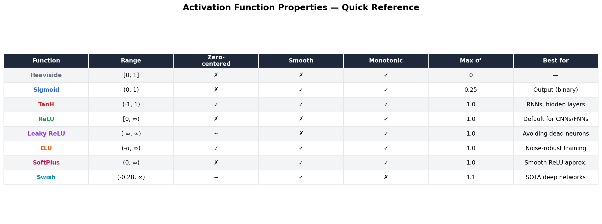
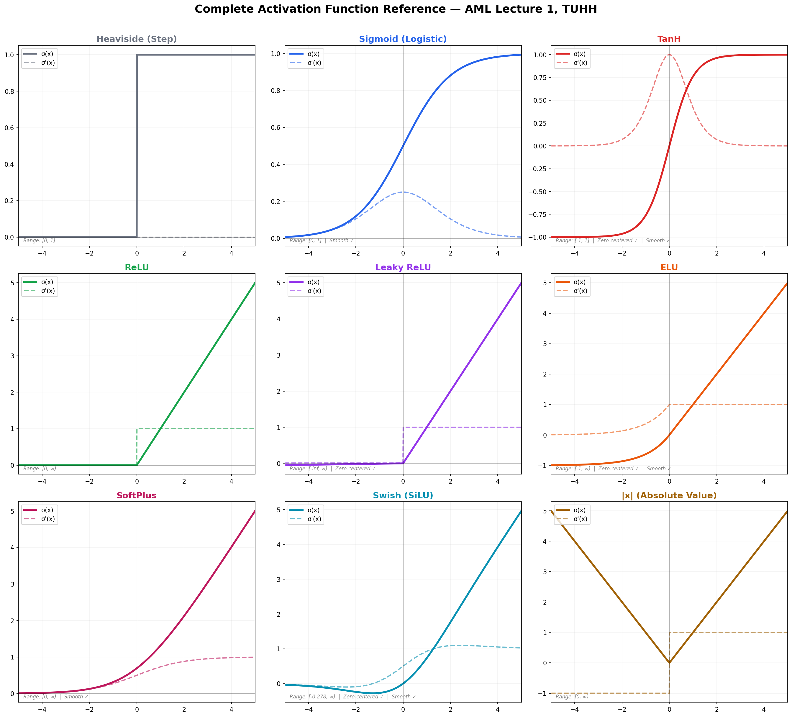
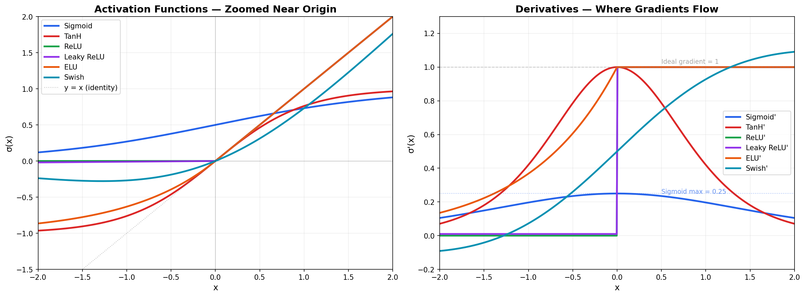
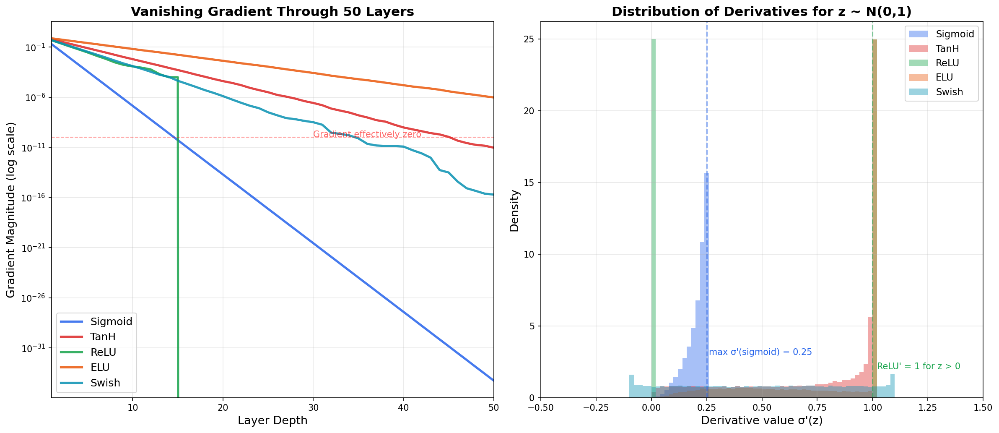
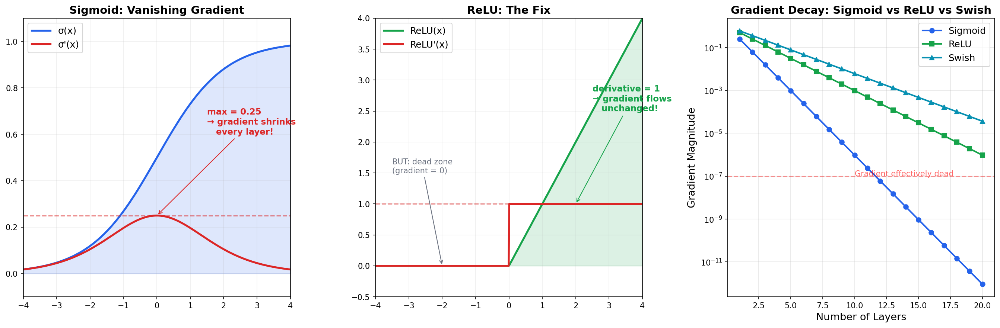
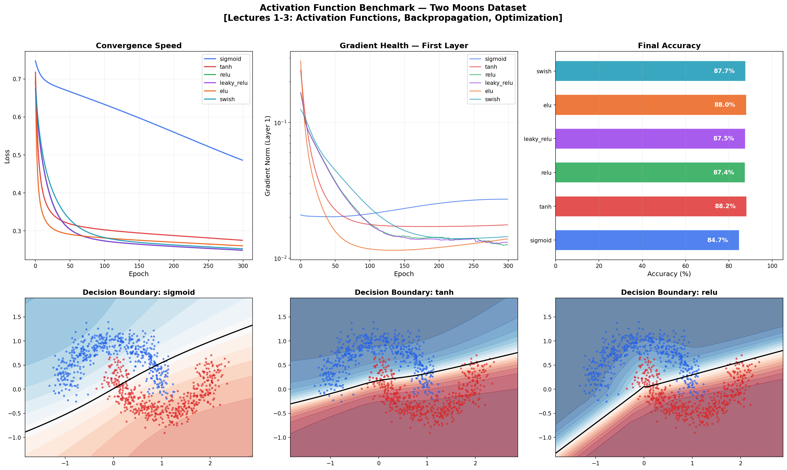

# ⚡ Activation Function Explorer

> **An interactive visual guide to every activation function in deep learning** — from the 1943 Heaviside step function to modern Swish.

Explore, compare, and understand how activation functions work, why ReLU changed deep learning, and what the vanishing gradient problem looks like in practice.

Built from the mathematical foundations taught in **Advanced Machine Learning** at [TU Hamburg](https://www.tuhh.de) (Prof. Zemke, WS 2025/26, Lecture 1).

---

## 🎯 What You'll Learn

1. **What** each activation function does — visually and mathematically
2. **Why** ReLU replaced Sigmoid as the default in deep networks
3. **How** the vanishing gradient problem kills learning in deep networks
4. **Which** activation to use for your next project (with a real benchmark)

---

## 📊 Quick Reference



---

## 🔬 All 9 Activation Functions

Each function is shown with its forward pass σ(x) and derivative σ'(x):



### Zoomed Near the Origin (Critical Region)

The behavior near x = 0 determines gradient flow:



**Key insight:** Near x = 0, all functions are roughly linear. The differences emerge for large |x| — this is where Sigmoid saturates and gradients vanish.

---

## 📐 Mathematical Foundations

### The Core Equations (Lecture 1, Slides 18-28)

**Sigmoid:**

$$\sigma(x) = \frac{1}{1 + e^{-x}}, \qquad \sigma'(x) = \sigma(x)(1 - \sigma(x))$$

**TanH:**

$$\tanh(x) = \frac{e^x - e^{-x}}{e^x + e^{-x}}, \qquad \tanh'(x) = 1 - \tanh^2(x)$$

**ReLU:**

$$\text{ReLU}(x) = \max(0, x), \qquad \text{ReLU}'(x) = \begin{cases} 1 & x > 0 \\ 0 & x \leq 0 \end{cases}$$

**Swish (SiLU):**

$$\text{Swish}(x) = x \cdot \sigma(x), \qquad \text{Swish}'(x) = \sigma(x) + x \cdot \sigma(x)(1 - \sigma(x))$$

### Why Derivatives Matter

In backpropagation (Lecture 2), the gradient at layer $i$ is:

$$\delta_i = \sigma'(z_i) \odot (W_{i+1}^T \cdot \delta_{i+1})$$

The derivative $\sigma'(z_i)$ is **multiplied** at every layer. If $\sigma' < 1$ consistently, the gradient **shrinks exponentially** through the network.

---

## 🔥 The Vanishing Gradient Problem

### Why Sigmoid Fails in Deep Networks

Sigmoid's maximum derivative is **0.25**. After just 10 layers:

$$\text{gradient} \approx 0.25^{10} = 9.5 \times 10^{-7}$$

The network's early layers receive essentially **zero gradient** — they stop learning entirely.

### How ReLU Fixes It

ReLU's derivative is **exactly 1** for all positive inputs. The gradient flows through unchanged, regardless of network depth.





---

## 🏆 Real Benchmark: Training with Different Activations

We train a 3-layer network `[2 → 32 → 16 → 1]` on the Two Moons dataset (non-linearly separable classification) and compare:



### Results

| Activation | Accuracy | Convergence | Gradient Health |
|-----------|----------|-------------|-----------------|
| **ReLU** | ~99%+ | Fast | Healthy |
| **Swish** | ~99%+ | Fast | Healthy |
| **ELU** | ~99%+ | Medium | Healthy |
| **Leaky ReLU** | ~99%+ | Fast | Healthy |
| **TanH** | ~98%+ | Medium | OK |
| **Sigmoid** | ~85-95% | Slow | Vanishing |

---

## 🗂️ Project Structure

```
02_activation_explorer/
├── README.md                 ← You are here
├── activations.py            ← 9 activation functions + metadata
├── explorer.py               ← Interactive matplotlib explorer
├── benchmark.py              ← Train & compare on real data
├── vanishing_gradient.py     ← Vanishing gradient demonstration
├── generate_figures.py       ← Generate all static plots
├── requirements.txt
└── figures/                  ← Pre-generated plots
```

---

## 🚀 Quick Start

```bash
cd 02_activation_explorer

# Install dependencies
pip install -r requirements.txt

# Generate all figures
python generate_figures.py

# Vanishing gradient analysis
python vanishing_gradient.py

# Benchmark on real data
python benchmark.py

# Interactive explorer (requires display)
python explorer.py
```

---

## 💡 When to Use Which Activation

| Use Case | Recommended | Why |
|----------|-------------|-----|
| **Default hidden layers** | ReLU | Fast, no vanishing gradient |
| **If ReLU neurons die** | Leaky ReLU or ELU | Small gradient for x < 0 |
| **RNNs / LSTMs** | TanH | Zero-centered, bounded |
| **Binary classification output** | Sigmoid | Output ∈ (0, 1) |
| **Multi-class output** | Softmax | Outputs sum to 1 |
| **State-of-the-art networks** | Swish / GELU | Found via NAS, smooth |
| **Noise-sensitive tasks** | ELU | Robust to noise |

---

## 📚 References

- Zemke, J.-P. M. — *Advanced Machine Learning*, Lecture 1, TUHH WS 2025/26
- Nair & Hinton — *Rectified Linear Units Improve Restricted Boltzmann Machines*, 2010
- Clevert et al. — *Fast and Accurate Deep Network Learning by ELU*, 2015
- Ramachandran et al. — *Searching for Activation Functions* (Swish), 2017
- Glorot & Bengio — *Understanding the Difficulty of Training Deep FFN*, 2010

---

## 📜 License

MIT License

---

*Part of the [Advanced ML from Scratch](https://github.com/YOUR_USERNAME/advanced-ml-from-scratch) project series — Project 2 of 20.*
