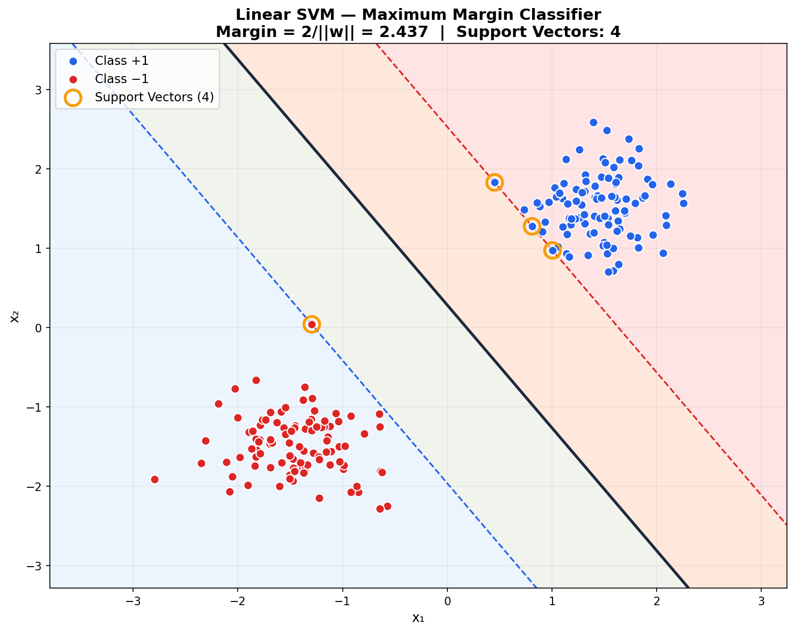
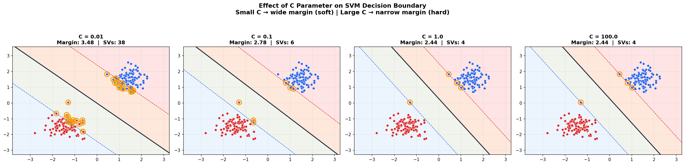
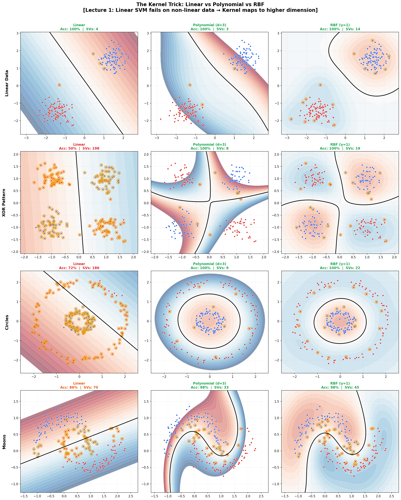
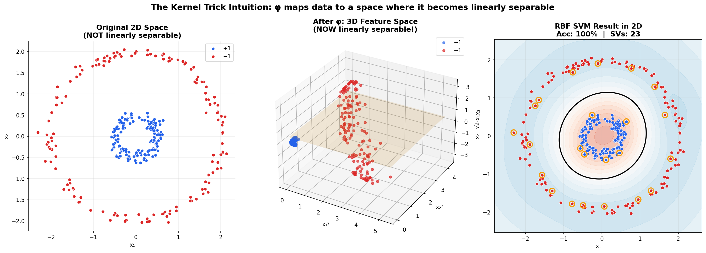
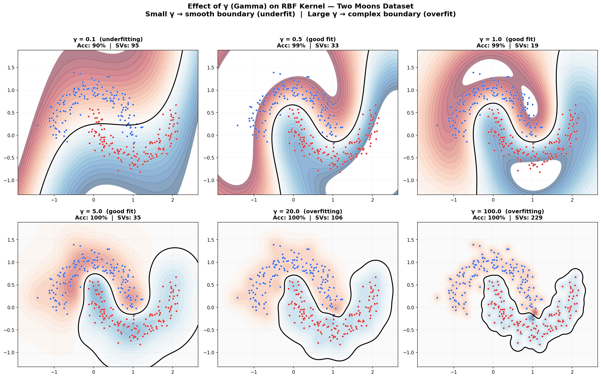

# ⚔️ SVM Classifier — From Scratch with Kernel Trick

> **A complete Support Vector Machine implementation using only NumPy** — including the SMO algorithm, 4 kernel functions, and visualizations of margin, support vectors, and the kernel trick.

Solves linearly separable data, XOR, concentric circles, and spiral patterns — all from scratch.

Built from the mathematical foundations in **Advanced Machine Learning** at [TU Hamburg](https://www.tuhh.de) (Prof. Zemke, WS 2025/26, Lecture 1).

---

## 📌 What You'll Learn

1. **How** SVMs find the maximum margin hyperplane
2. **Why** XOR cannot be solved by a linear classifier
3. **What** the kernel trick does (maps data to higher dimensions)
4. **When** to use RBF vs polynomial vs linear kernels
5. **How** C and γ control underfitting vs overfitting

---

## 📐 Mathematical Foundations

### The Separating Hyperplane (Lecture 1, Slide 8)

The SVM finds a hyperplane $w^T x + b = 0$ that separates two classes with **maximum margin**:

$$\text{Margin} = \frac{2}{\|w\|_2}$$

### Optimization Problem (Lecture 1, Slide 11)

$$\min_{w, b} \frac{1}{2}\|w\|^2 \qquad \text{s.t.} \quad y_i(w^T x_i + b) \geq 1 \quad \forall i$$

### Dual Problem (Lagrange Multipliers)

$$\max_{\alpha} \sum_i \alpha_i - \frac{1}{2}\sum_{i,j} \alpha_i \alpha_j y_i y_j K(x_i, x_j)$$

$$\text{s.t.} \quad 0 \leq \alpha_i \leq C, \quad \sum_i \alpha_i y_i = 0$$

### The Kernel Trick

Instead of computing $\varphi(x)$ explicitly, use a kernel function:

$$K(x, z) = \varphi(x)^T \varphi(z)$$

| Kernel | Formula | Feature Space |
|--------|---------|---------------|
| Linear | $x^T z$ | Original |
| Polynomial | $(x^T z + c)^d$ | All monomials up to degree d |
| RBF/Gaussian | $\exp(-\gamma\|x-z\|^2)$ | **Infinite** dimensional |

---

## 🎯 Results

### Linear SVM — Maximum Margin



### Effect of C Parameter

Small C → soft margin (allows errors, wide margin). Large C → hard margin (no errors, narrow margin).



### The Kernel Trick: Linear vs Polynomial vs RBF



### Kernel Trick Intuition — 2D to 3D Transformation



### Effect of γ (Gamma) on RBF Kernel



---

## 🗂️ Project Structure

```
03_svm_classifier/
├── README.md              ← You are here
├── svm.py                 ← SVM + MultiClassSVM (SMO algorithm)
├── kernels.py             ← Linear, Polynomial, RBF, Sigmoid kernels
├── datasets.py            ← 5 dataset generators (linear, XOR, circles, moons, spiral)
├── train_linear.py        ← Demo: linear SVM + margin + C parameter
├── train_kernels.py       ← Demo: kernel trick + gamma effect + 3D intuition
├── requirements.txt
└── figures/               ← Pre-generated plots
```

---

## 🚀 Quick Start

```bash
cd 03_svm_classifier

pip install -r requirements.txt

# Linear SVM + margin visualization
python train_linear.py

# Kernel trick demos
python train_kernels.py
```

---

## 📚 Concepts Implemented

| Concept | Lecture | File |
|---------|---------|------|
| Separating hyperplane wᵀx + b = 0 | L1, Slide 8 | `svm.py` |
| Maximum margin = 2/\|\|w\|\| | L1, Slide 11 | `svm.py → get_margin()` |
| Optimization min ½\|\|w\|\|² | L1, Slide 11 | `svm.py → fit()` |
| Support vectors (αᵢ > 0) | L1 | `svm.py` |
| XOR not linearly separable | L1, Slide 9 | `train_kernels.py` |
| Kernel trick K(x,z) = φ(x)ᵀφ(z) | L1 | `kernels.py` |
| SMO algorithm | Platt 1998 | `svm.py → fit()` |
| Soft margin (C parameter) | L1 | `train_linear.py` |
| One-vs-Rest multi-class | — | `svm.py → MultiClassSVM` |

---

## 💡 Key Takeaways

- **Linear SVM** works when data is linearly separable (OR, AND). Fails on XOR.
- **Kernel trick** maps data to higher dimensions where a linear boundary exists.
- **RBF kernel** maps to infinite dimensions — most powerful but risk of overfitting.
- **C controls** the tradeoff: large C → fewer errors but smaller margin.
- **γ controls** RBF complexity: small γ → smooth, large γ → complex.

---

## 📚 References

- Zemke, J.-P. M. — *Advanced Machine Learning*, Lecture 1, TUHH WS 2025/26
- Platt, J. — *Sequential Minimal Optimization*, Microsoft Research, 1998
- Cortes & Vapnik — *Support-Vector Networks*, Machine Learning, 1995
- Stanford CS229 — *Simplified SMO Algorithm*

---

## 📜 License

MIT License

---

*Part of the [Advanced ML from Scratch](https://github.com/YOUR_USERNAME/advanced-ml-from-scratch) project series — Project 3 of 20.*
