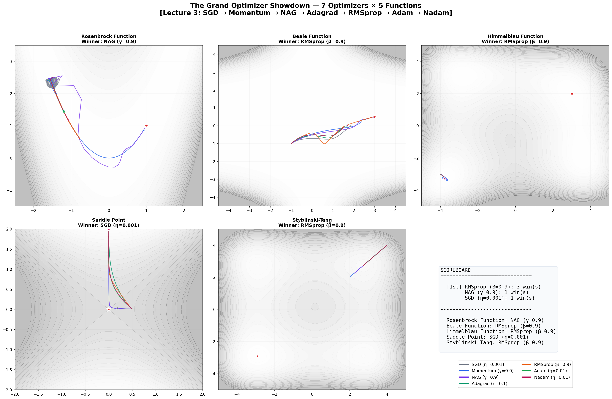
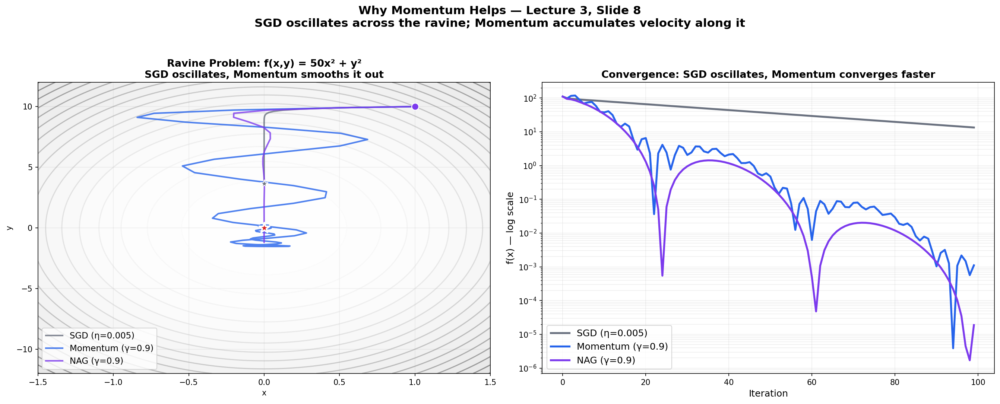
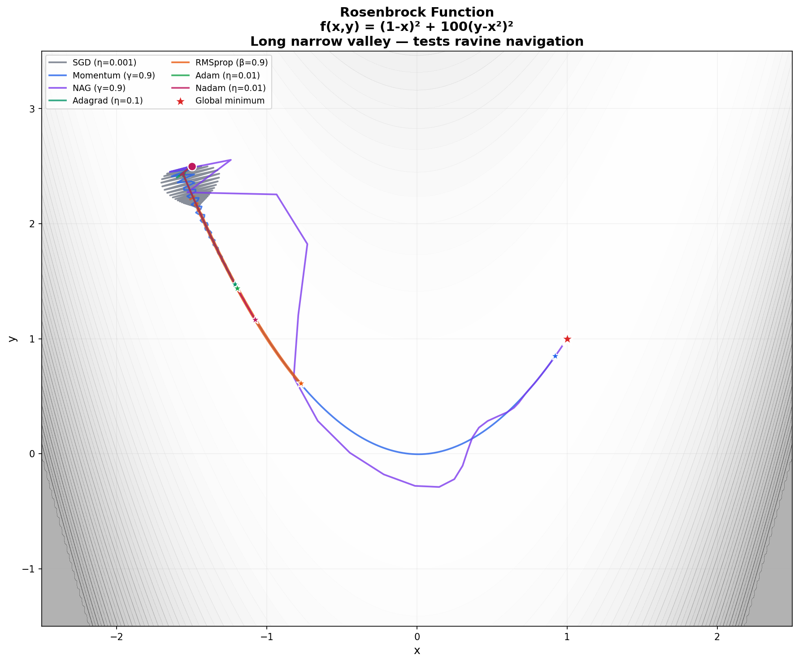
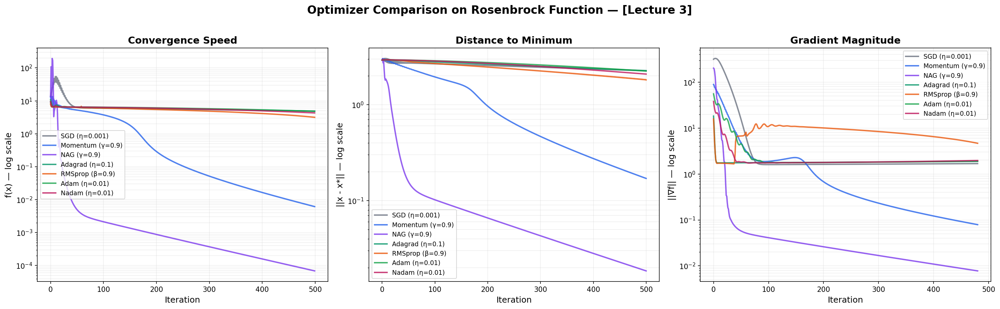
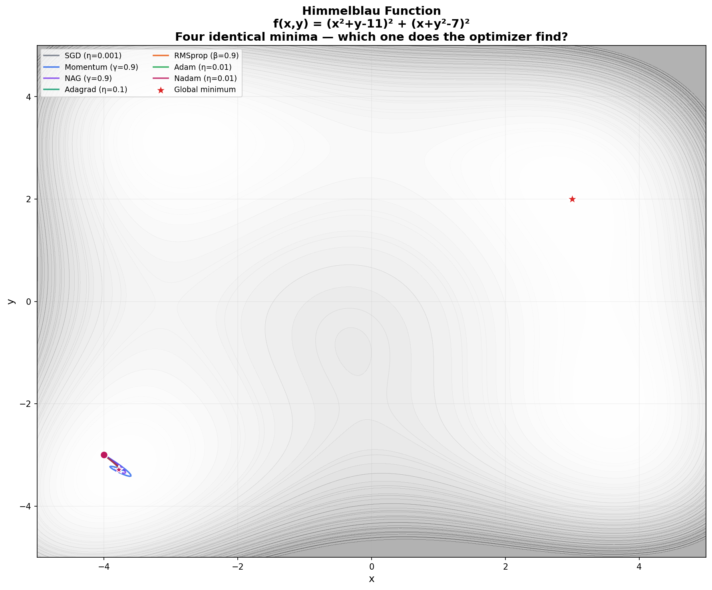

# 🏁 Optimizer Showdown — SGD vs Momentum vs Adam

> **7 gradient descent optimizers race head-to-head on 5 test functions** — implemented from scratch in NumPy, with animated-style trajectory plots.

Watch how SGD oscillates helplessly in ravines while Adam cruises to the minimum.

Built from **Advanced Machine Learning** at [TU Hamburg](https://www.tuhh.de) (Prof. Zemke, WS 2025/26, Lecture 3).

---

## 🏆 The Grand Showdown



---

## 📐 The Optimizers (Lecture 3)

### Evolution of Gradient Descent

```
SGD  →  Momentum  →  NAG  →  Adagrad  →  RMSprop  →  Adam  →  Nadam
(1951)   (1964)    (1983)   (2011)      (2012)     (2014)   (2016)
```

### Update Rules

**SGD:** $p \leftarrow p - \eta \nabla C$

**Momentum:** $v \leftarrow \gamma v + \eta \nabla C, \quad p \leftarrow p - v$

**NAG:** $v \leftarrow \gamma v + \eta \nabla C(p - \gamma v), \quad p \leftarrow p - v$

**Adam:**

$$m_t = \beta_1 m_{t-1} + (1-\beta_1)\nabla C, \quad v_t = \beta_2 v_{t-1} + (1-\beta_2)(\nabla C)^2$$

$$p \leftarrow p - \eta \cdot \frac{\hat{m}_t}{\sqrt{\hat{v}_t} + \epsilon}$$

---

## 🔬 Key Insights

### Why Momentum Helps

SGD oscillates across ravines. Momentum accumulates velocity along the consistent direction:



### Rosenbrock Function — The Classic Test

The narrow "banana valley" exposes differences between optimizers:





### Multiple Minima — Himmelblau Function

Different optimizers find different minima depending on their dynamics:



---

## 📊 Optimizer Comparison

| Optimizer | Strengths | Weaknesses | Hyperparameters |
|-----------|-----------|------------|-----------------|
| **SGD** | Simple, well-understood | Slow, oscillates in ravines | η |
| **Momentum** | Smooths oscillations | Can overshoot | η, γ |
| **NAG** | Look-ahead correction | Slightly complex | η, γ |
| **Adagrad** | Per-parameter adaptive LR | LR decays to zero | η |
| **RMSprop** | Fixes Adagrad's decay | Unpublished (Hinton) | η, β |
| **Adam** | Best of momentum + RMSprop | May not converge to best minimum | η, β₁, β₂ |
| **Nadam** | NAG + Adam combined | Most hyperparameters | η, β₁, β₂ |

---

## 🗂️ Project Structure

```
04_optimizer_showdown/
├── README.md              ← You are here
├── optimizers.py          ← 7 optimizers from scratch
├── test_functions.py      ← 5 test functions (Rosenbrock, Beale, ...)
├── showdown.py            ← Main race + all visualizations
├── requirements.txt
└── figures/
```

---

## 🚀 Quick Start

```bash
cd 04_optimizer_showdown
pip install -r requirements.txt
python showdown.py
```

---

## 📚 References

- Zemke, J.-P. M. — *Advanced Machine Learning*, Lecture 3, TUHH WS 2025/26
- Kingma & Ba — *Adam: A Method for Stochastic Optimization*, 2014
- Sutskever et al. — *On the Importance of Initialization and Momentum*, 2013
- Duchi et al. — *Adaptive Subgradient Methods* (Adagrad), 2011
- Dozat — *Incorporating Nesterov Momentum into Adam* (Nadam), 2016

---

## 📜 License

MIT License

---

*Part of the [Advanced ML from Scratch](https://github.com/YOUR_USERNAME/advanced-ml-from-scratch) project series — Project 4 of 20.*
