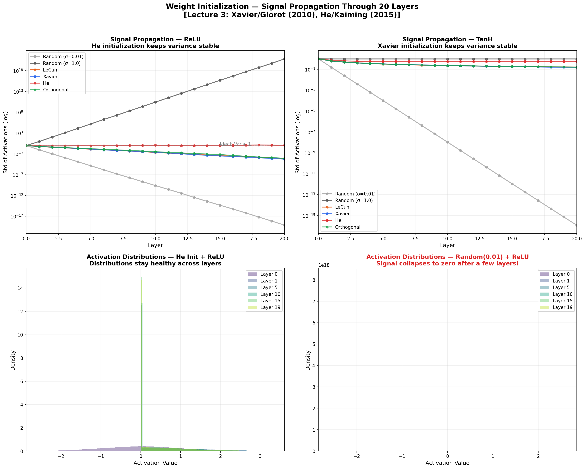
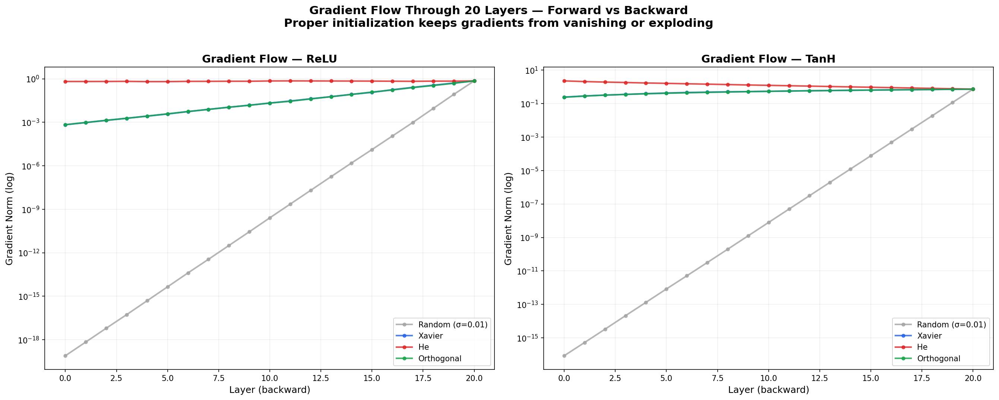
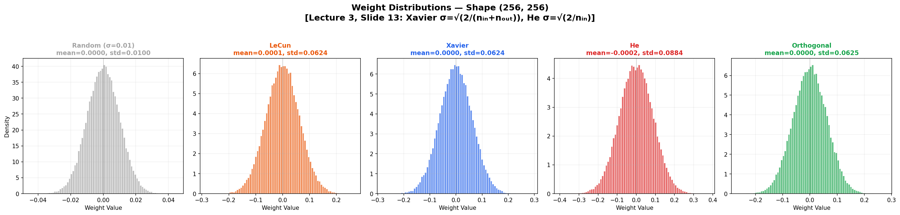
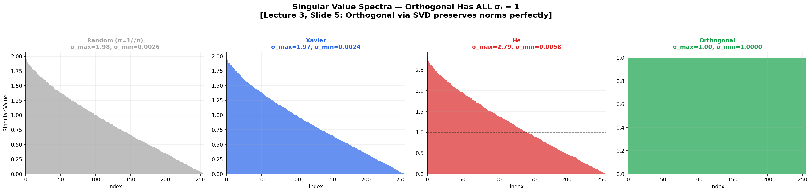
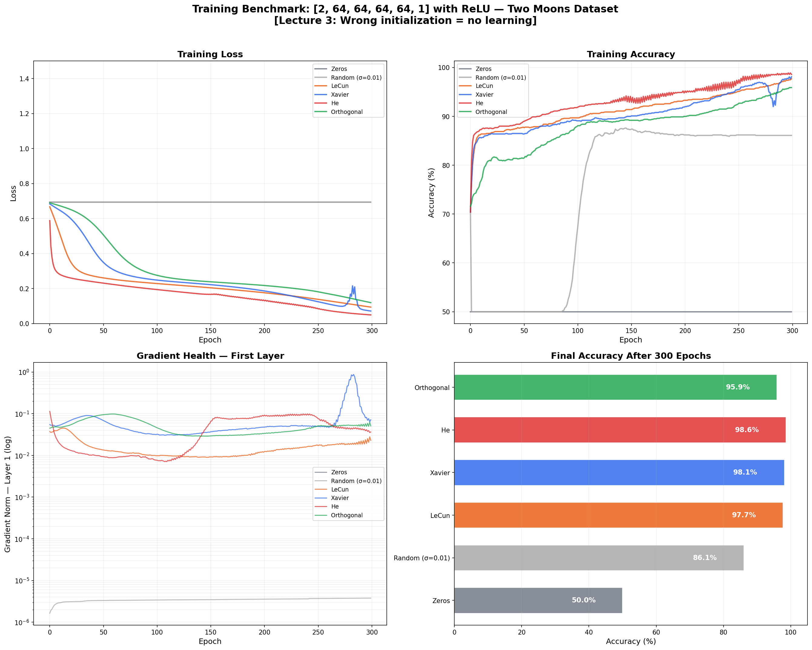

# 🎲 Weight Initialization Study

> **Why do neural networks fail to train? Often it's the FIRST thing you set: the initial weights.**

This project demonstrates how weight initialization determines whether a network learns or dies — with signal propagation analysis, gradient flow visualization, and real training benchmarks.

Built from **Advanced Machine Learning** at [TU Hamburg](https://www.tuhh.de) (Prof. Zemke, WS 2025/26, Lecture 3, Slides 9-14).

---

## 📐 The Math (Lecture 3, Slide 13)

### The Problem

Each layer computes $a_{i+1} = \sigma(W_i a_i + b_i)$. If we stack 20 layers:

- Weights too small → activations shrink to 0 (signal dies)
- Weights too large → activations explode to ±∞ (numerical overflow)
- Weights just right → signal stays stable (network can learn)

### The Solutions

| Method | Formula | Best For |
|--------|---------|----------|
| **Xavier/Glorot** | $\sigma = \sqrt{\frac{2}{n_{in} + n_{out}}}$ | TanH, Sigmoid |
| **He/Kaiming** | $\sigma = \sqrt{\frac{2}{n_{in}}}$ | ReLU, Leaky ReLU |
| **Orthogonal** | $W = Q$ from SVD, all $\sigma_i = 1$ | RNNs, very deep nets |
| **LeCun** | $\sigma = \sqrt{\frac{1}{n_{in}}}$ | SELU |

### Why He Uses 2/nᵢₙ Instead of 2/(nᵢₙ+nₒᵤₜ)

ReLU zeros out ~50% of neurons. To compensate for this halving of variance, He initialization doubles the variance compared to Xavier.

---

## 📊 Results

### Signal Propagation Through 20 Layers



### Gradient Flow Analysis



### Weight Distributions



### Singular Value Spectra



### Training Benchmark — Real Impact on Learning



---

## 🗂️ Project Structure

```
05_weight_initialization/
├── README.md               ← You are here
├── initializations.py      ← 6 initialization methods + metadata
├── study.py                ← Signal propagation + gradient flow analysis
├── benchmark.py            ← Real training comparison
├── requirements.txt
└── figures/
```

---

## 🚀 Quick Start

```bash
cd 05_weight_initialization
pip install -r requirements.txt

# Signal propagation + gradient flow + distributions
python study.py

# Real training benchmark
python benchmark.py
```

---

## 💡 Key Takeaways

1. **Zero init = death.** All neurons compute the same thing. No learning.
2. **Random(σ=0.01) = slow death.** Signal vanishes after ~5 layers.
3. **Xavier = perfect for TanH/Sigmoid.** Keeps Var(activation) ≈ constant.
4. **He = perfect for ReLU.** Accounts for the 50% zero-out.
5. **Orthogonal = all singular values = 1.** Best norm preservation.

---

## 📚 References

- Zemke, J.-P. M. — *Advanced Machine Learning*, Lecture 3, TUHH WS 2025/26
- Glorot & Bengio — *Understanding the Difficulty of Training Deep FFN*, AISTATS 2010
- He, Zhang, Ren & Sun — *Delving Deep into Rectifiers*, ICCV 2015
- Saxe, McClelland & Ganguli — *Exact Solutions to the Nonlinear Dynamics of Learning in Deep Linear Neural Networks*, ICLR 2014

---

## 📜 License

MIT License

---

*Part of the [Advanced ML from Scratch](https://github.com/YOUR_USERNAME/advanced-ml-from-scratch) project series — Project 5 of 20.*
