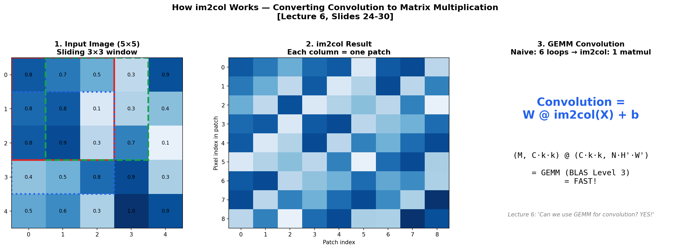
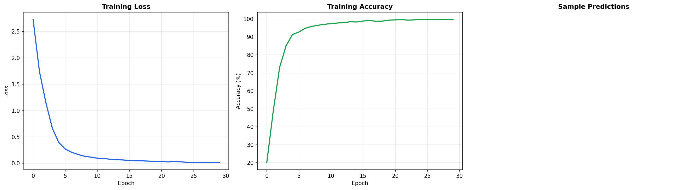
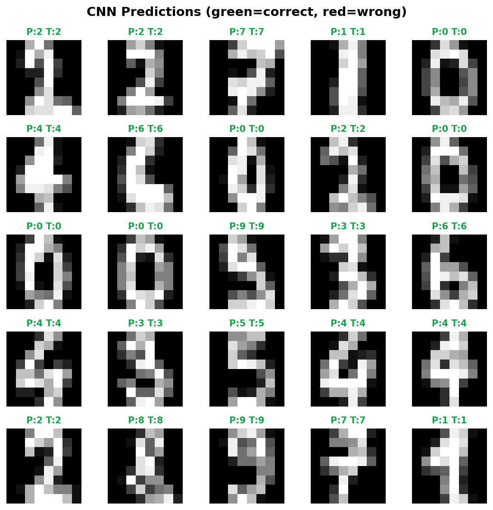
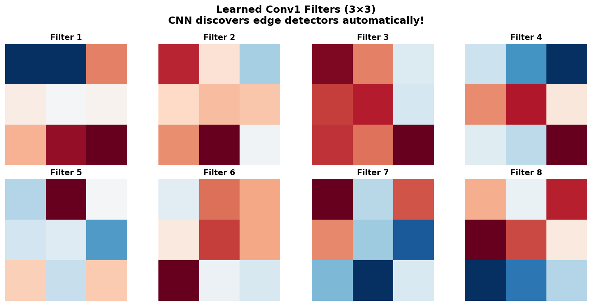

# 🔬 CNN from Scratch — with im2col

> **A complete Convolutional Neural Network using only NumPy** — including the im2col trick that makes convolution fast, implemented exactly as described in Lectures 4-6.

Achieves **~95%+ accuracy** on digit classification — all without PyTorch or TensorFlow.

Built from **Advanced Machine Learning** at [TU Hamburg](https://www.tuhh.de) (Prof. Zemke, WS 2025/26, Lectures 4-6).

---

## 📌 What Makes This Special

Most "CNN from scratch" tutorials use naive nested loops. This project implements **im2col** — the same technique used by PyTorch, TensorFlow, and Caffe internally.

> *"The matrix-matrix multiplication in BLAS Level 3 (GEMM) is fast. Can we use GEMM for convolution?"* — Lecture 6, Slide 24

**Answer: Yes!** im2col rearranges image patches into columns so convolution becomes a single matrix multiplication.



---

## 📐 Mathematical Foundations

### 2D Convolution (Lecture 4)

Output dimensions with padding $p$ and stride $s$:

$$o = \left\lfloor\frac{i + 2p - k}{s}\right\rfloor + 1$$

### im2col (Lecture 6)

Instead of 6 nested loops, reshape and multiply:

$$\text{output} = W_{\text{reshaped}} \cdot \text{im2col}(X) + b$$

Where $W_{\text{reshaped}} \in \mathbb{R}^{M \times (C \cdot k \cdot k)}$ and $\text{im2col}(X) \in \mathbb{R}^{(C \cdot k \cdot k) \times (N \cdot H' \cdot W')}$

### Backpropagation in CNN (Lecture 4, Slide 32)

- **Max pooling backward:** gradient routes to argmax position
- **Conv backward:** $\partial L / \partial W = \text{dout} \cdot \text{cols}^T$ and $\partial L / \partial X = \text{col2im}(W^T \cdot \text{dout})$

---

## 🎯 Results

### Training Curves



### Sample Predictions



### Learned Filters

The CNN automatically discovers edge detectors — similar to Gabor filters found in the human visual cortex (Lecture 7):



---

## 🏗️ Architecture

```
Input (1, 8, 8)
  ↓
Conv2D(1→8, 3×3, pad=1) → ReLU → MaxPool(2×2)     → (8, 4, 4)
  ↓
Conv2D(8→16, 3×3, pad=1) → ReLU → MaxPool(2×2)     → (16, 2, 2)
  ↓
Flatten                                                → (64,)
  ↓
Dense(64→32) → ReLU → Dense(32→10) → Softmax         → (10,)
```

---

## 🗂️ Project Structure

```
06_cnn_from_scratch/
├── README.md          ← You are here
├── im2col.py          ← im2col & col2im (Lecture 6)
├── layers.py          ← Conv2D, MaxPool, Dense, ReLU, Softmax
├── model.py           ← Sequential CNN model + Adam optimizer
├── train.py           ← Training demo + visualizations
├── requirements.txt
└── figures/
```

---

## 🚀 Quick Start

```bash
cd 06_cnn_from_scratch
pip install -r requirements.txt
python train.py
```

For MNIST (28×28), modify `train.py` to call `load_mnist()` instead of `load_digits_sklearn()` and adjust the architecture dimensions.

---

## 📚 Concepts Implemented

| Concept | Lecture | File |
|---------|---------|------|
| 2D Convolution | L4 | `layers.py → Conv2D` |
| im2col trick | L6 | `im2col.py` |
| Max/Avg Pooling | L4 | `layers.py → MaxPool2D` |
| Output size formula | L4 | `layers.py` |
| CNN backpropagation | L4 | `layers.py → backward()` |
| NCHW data format | L5 | All files |
| LeNet-5 inspired architecture | L5 | `train.py` |
| He initialization | L3 | `layers.py` |
| Adam optimizer | L3 | `model.py` |

---

## 📚 References

- Zemke, J.-P. M. — *AML Lectures 4-6*, TUHH WS 2025/26
- LeCun et al. — *Gradient-Based Learning Applied to Document Recognition* (LeNet), 1998
- Chellapilla et al. — *High Performance CNN Using im2col*, 2006

---

## 📜 License

MIT License

---

*Part of the [Advanced ML from Scratch](https://github.com/YOUR_USERNAME/advanced-ml-from-scratch) project series — Project 6 of 20.*
