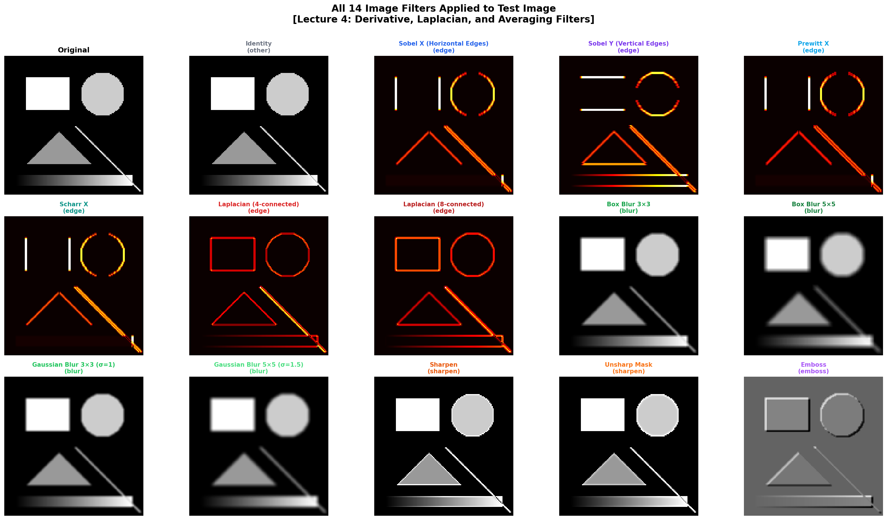
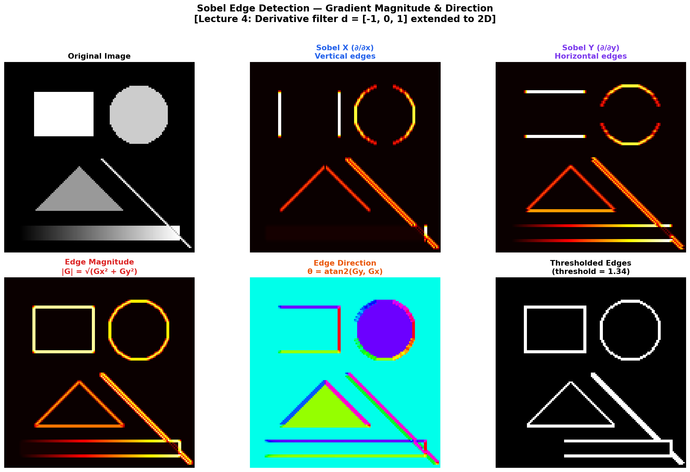
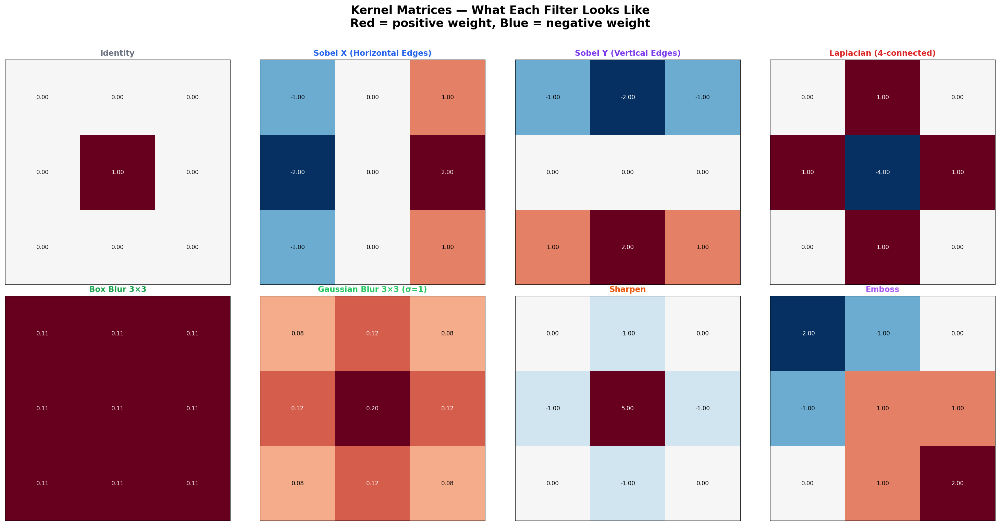
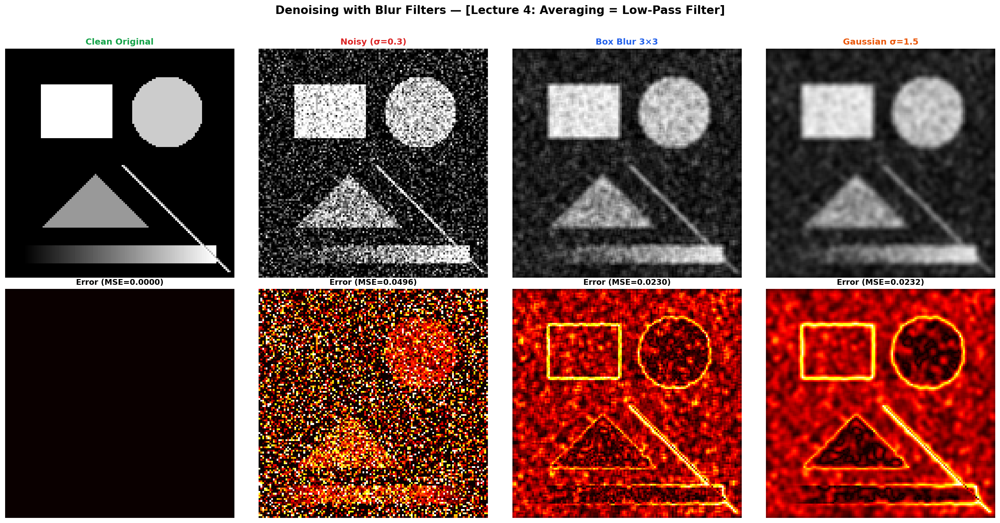
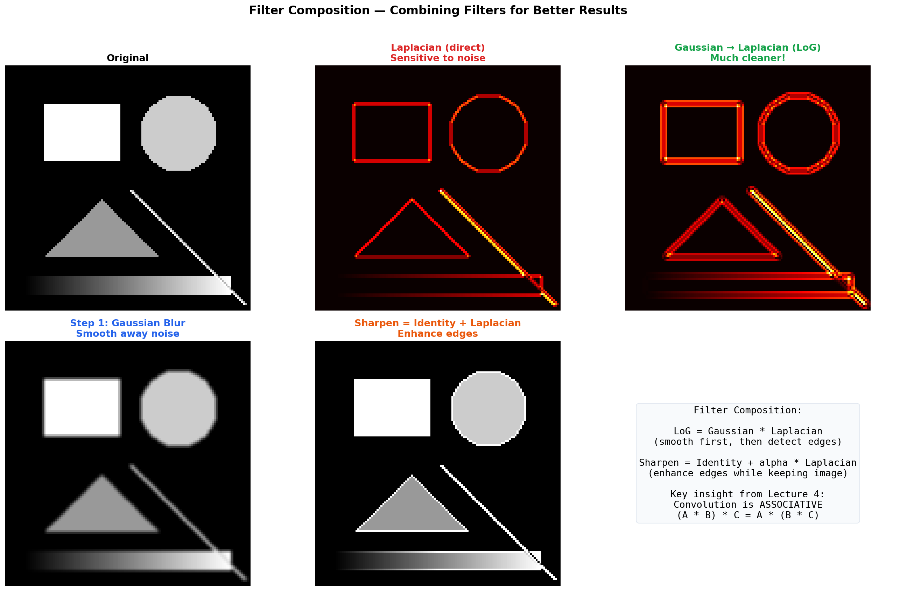

# 🎨 Image Filter Lab

> **14 classic image filters implemented from scratch** — Sobel, Laplacian, Gaussian, Sharpen, and more. No OpenCV, no scipy — pure NumPy convolution.

See how edge detection, blur, and sharpening work at the pixel level — the same operations that CNN first layers learn automatically.

Built from **Advanced Machine Learning** at [TU Hamburg](https://www.tuhh.de) (Prof. Zemke, WS 2025/26, Lecture 4).

---

## 📊 All 14 Filters



---

## 📐 Mathematical Foundations (Lecture 4)

### 1D Filters

From Lecture 4, Slide 8:

**Derivative:** $d = [-1, 1] / h$ → detects edges (gradient)

**Laplacian:** $d = [-1, 2, -1] / h^2$ → detects curvature (2nd derivative)

**Averaging:** $d = [1, 1, 1] / 3$ → smooths noise (low-pass filter)

### 2D Cross-Correlation (Lecture 4, Slide 10)

$$(x \star d)_i = \sum_k x_{i+k} \cdot d_k$$

### Output Size (Lecture 4, Slide 24)

$$o = \left\lfloor\frac{i + 2p - k}{s}\right\rfloor + 1$$

---

## 🔬 Key Visualizations

### Sobel Edge Detection



### Kernel Matrices



### Denoising with Blur Filters



### Filter Composition (LoG, Sharpen)



---

## 🗂️ Project Structure

```
07_image_filter_lab/
├── README.md          ← You are here
├── kernels.py         ← 14 filters + 2D convolution from scratch
├── filter_lab.py      ← All demos + 5 plot generators
├── requirements.txt
└── figures/
```

## 🚀 Quick Start

```bash
cd 07_image_filter_lab
pip install -r requirements.txt
python filter_lab.py
```

No external images needed — all test images are generated programmatically.

---

## 📚 References

- Zemke, J.-P. M. — *AML Lecture 4*, TUHH WS 2025/26
- Sobel & Feldman — *A 3×3 Isotropic Gradient Operator*, 1968
- Marr & Hildreth — *Theory of Edge Detection* (LoG), 1980

---

## 📜 License

MIT License

---

*Part of the [Advanced ML from Scratch](https://github.com/YOUR_USERNAME/advanced-ml-from-scratch) project series — Project 7 of 20.*
