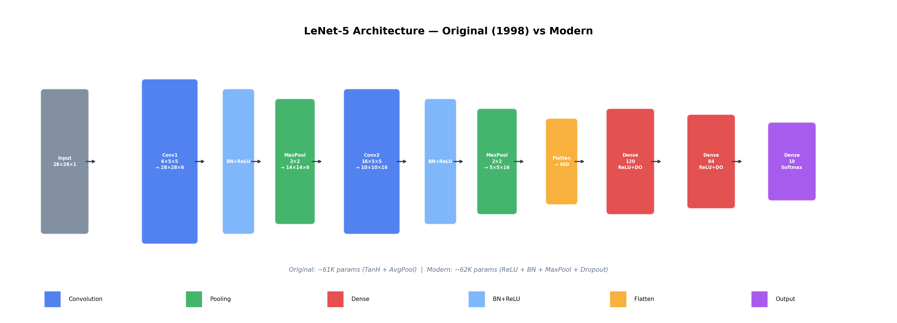
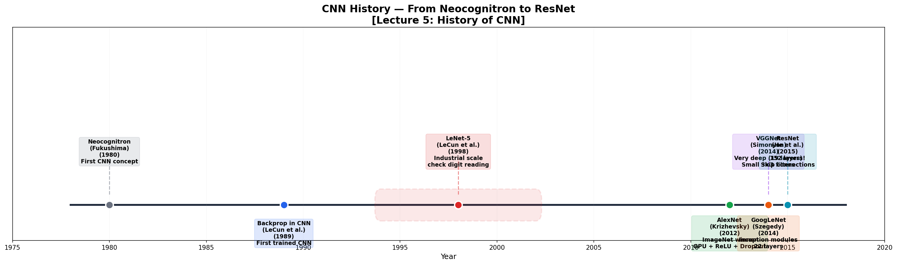

# 🏛️ LeNet-5 on MNIST — Original (1998) vs Modern

> **The CNN that started it all** — implemented in Keras, comparing the original 1998 architecture with a modern version using BatchNorm, Dropout, and ReLU.

Expected accuracy: **~99%** (Original ~98.5%, Modern ~99.2%)

Built from **Advanced Machine Learning** at [TU Hamburg](https://www.tuhh.de) (Prof. Zemke, WS 2025/26, Lecture 5).

---

## 📜 From Lecture 5

> *"LeNet-5 by LeCun et al. from 1998 was used on industrial scale for deciphering handwritten digits on checks and can be considered the first successful CNN."*

---

## 🏗️ Architecture



### Original LeNet-5 (1998)

```
Input (28×28×1) → Pad to 32×32
  → Conv(6, 5×5, TanH) → AvgPool(2×2)     → (6, 14, 14)
  → Conv(16, 5×5, TanH) → AvgPool(2×2)    → (16, 5, 5)
  → Flatten → Dense(120, TanH) → Dense(84, TanH) → Dense(10, Softmax)
```

### Modern LeNet-5 (with Lecture 1-3 improvements)

```
Input (28×28×1)
  → Conv(6, 5×5) → BN → ReLU → MaxPool     → (6, 14, 14)
  → Conv(16, 5×5) → BN → ReLU → MaxPool    → (16, 5, 5)
  → Flatten → Dense(120, ReLU, Dropout=0.5)
  → Dense(84, ReLU, Dropout=0.3) → Dense(10, Softmax)
```

### What Changed and Why

| Component | Original (1998) | Modern | Why (Lecture) |
|-----------|----------------|--------|---------------|
| Activation | TanH | ReLU | No vanishing gradient (L1) |
| Pooling | Average | Max | Stronger feature selection (L4) |
| Normalization | None | BatchNorm | Stable training (L3) |
| Regularization | None | Dropout | Prevents overfitting (L3) |
| Initialization | Random | He/Kaiming | Proper variance scaling (L3) |
| Optimizer | SGD | Adam | Adaptive learning rate (L3) |

---

## 📊 CNN History Timeline



---

## 📐 Key Formulas

### Convolution Output Size (Lecture 4)

$$o = \left\lfloor\frac{i + 2p - k}{s}\right\rfloor + 1$$

### LeNet-5 Dimensions

| Layer | Input | Kernel | Output | Parameters |
|-------|-------|--------|--------|------------|
| Conv1 | 32×32×1 | 5×5×6 | 28×28×6 | 156 |
| Pool1 | 28×28×6 | 2×2 | 14×14×6 | 0 |
| Conv2 | 14×14×6 | 5×5×16 | 10×10×16 | 2,416 |
| Pool2 | 10×10×16 | 2×2 | 5×5×16 | 0 |
| Dense1 | 400 | — | 120 | 48,120 |
| Dense2 | 120 | — | 84 | 10,164 |
| Output | 84 | — | 10 | 850 |
| **Total** | | | | **~61,706** |

---

## 🚀 Quick Start

```bash
cd 08_lenet5_mnist

# Install dependencies
pip install -r requirements.txt

# Generate architecture diagrams (no TF needed)
python visualize.py

# Train both models and compare (requires TensorFlow)
python train_lenet5.py
```

---

## 🗂️ Project Structure

```
08_lenet5_mnist/
├── README.md             ← You are here
├── train_lenet5.py       ← Train Original + Modern LeNet-5
├── visualize.py          ← Architecture diagram + CNN timeline
├── requirements.txt
└── figures/
    ├── architecture.png  ← Pre-generated (no TF needed)
    └── cnn_timeline.png  ← Pre-generated (no TF needed)
```

After running `train_lenet5.py`, additional plots are generated:
- `figures/comparison.png` — Training curves + accuracy comparison
- `figures/predictions.png` — Sample MNIST predictions
- `figures/filters.png` — Learned first-layer filters

---

## 📚 Concepts Demonstrated

| Concept | Lecture | Implementation |
|---------|---------|---------------|
| CNN architecture | L4-L5 | Both model variants |
| TanH vs ReLU | L1 | Original vs Modern |
| AvgPool vs MaxPool | L4 | Original vs Modern |
| Batch Normalization | L3 | Modern model |
| Dropout | L3 | Modern model |
| He initialization | L3 | Modern model |
| Adam optimizer | L3 | Both models |
| LeNet-5 history | L5 | Timeline diagram |

---

## 📚 References

- Zemke, J.-P. M. — *AML Lecture 5*, TUHH WS 2025/26
- LeCun, Bottou, Bengio & Haffner — *Gradient-Based Learning Applied to Document Recognition*, 1998
- Krizhevsky, Sutskever & Hinton — *ImageNet Classification with Deep CNNs* (AlexNet), 2012

---

## 📜 License

MIT License

---

*Part of the [Advanced ML from Scratch](https://github.com/YOUR_USERNAME/advanced-ml-from-scratch) project series — Project 8 of 20.*
