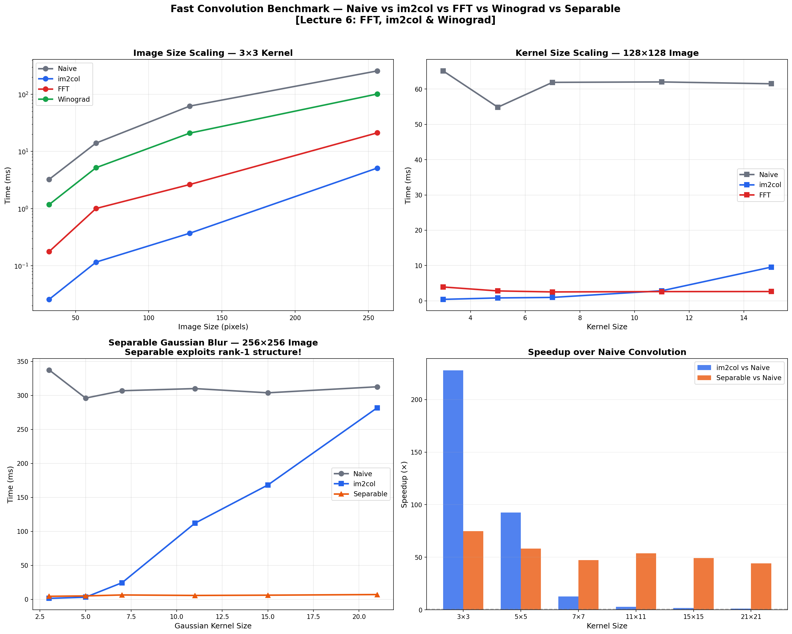
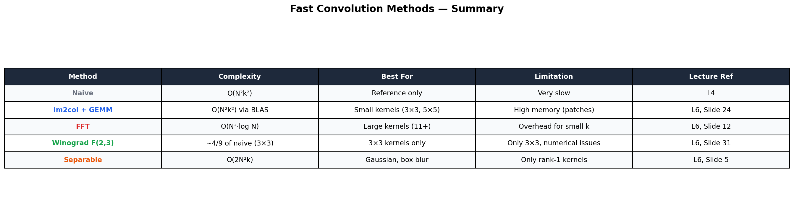
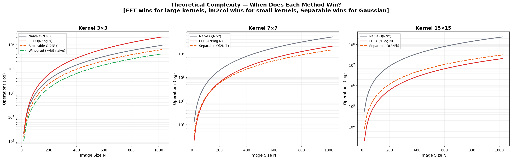

# ⚡ Fast Convolution Benchmark

> **5 convolution methods race head-to-head** — Naive, im2col+GEMM, FFT, Winograd, and Separable. All implemented from scratch, benchmarked across image sizes and kernel sizes.

Discover when FFT beats im2col, why Winograd is king for 3×3 kernels, and how separable kernels give free speedups for Gaussian blur.

Built from **Advanced Machine Learning** at [TU Hamburg](https://www.tuhh.de) (Prof. Zemke, WS 2025/26, Lecture 6).

---

## 📊 Benchmark Results



---

## 📐 The Five Methods (Lecture 6)



### 1. Naive — O(N²k²)
Six nested loops. The baseline. Correct but slow.

### 2. im2col + GEMM — O(N²k²) via BLAS  [Slide 24]
Rearrange patches into columns, then use matrix multiplication. Same algorithmic complexity as naive, but BLAS makes it 10-100× faster.

### 3. FFT — O(N²·log N)  [Slide 12]
Convolution theorem: $\text{conv}(x, h) = \mathcal{F}^{-1}(\mathcal{F}(x) \cdot \mathcal{F}(h))$. Wins for large kernels (11×11+).

### 4. Winograd F(2,3) — ~4/9 of naive for 3×3  [Slide 31]
Minimal multiplication algorithm. Transforms both input and kernel, multiplies element-wise. Only 16 multiplications per tile instead of 36.

### 5. Separable — O(2N²k) for rank-1 kernels  [Slide 5]
If kernel = column × row (like Gaussian), split into two 1D passes. Turns O(k²) into O(2k) per pixel.

---

## 📈 Theoretical Complexity



### When to Use Which

| Kernel Size | Best Method | Why |
|-------------|-------------|-----|
| **3×3** | Winograd or im2col | Minimal multiplications |
| **5×5 to 9×9** | im2col + GEMM | BLAS is highly optimized |
| **11×11+** | FFT | O(N log N) beats O(Nk²) |
| **Gaussian/Box** | Separable | O(2k) instead of O(k²) |

---

## 🗂️ Project Structure

```
09_fast_convolution/
├── README.md                  ← You are here
├── convolution_methods.py     ← All 5 methods from scratch
├── benchmark.py               ← Timing + plots
├── requirements.txt
└── figures/
```

## 🚀 Quick Start

```bash
cd 09_fast_convolution
pip install -r requirements.txt
python benchmark.py
```

---

## 📚 References

- Zemke, J.-P. M. — *AML Lecture 6: FFT, im2col & Winograd*, TUHH WS 2025/26
- Chellapilla et al. — *High Performance CNN Using im2col*, 2006
- Lavin & Gray — *Fast Algorithms for CNNs* (Winograd), 2016
- Cooley & Tukey — *An Algorithm for the Machine Calculation of Complex Fourier Series* (FFT), 1965

---

## 📜 License

MIT License

---

*Part of the [Advanced ML from Scratch](https://github.com/YOUR_USERNAME/advanced-ml-from-scratch) project series — Project 9 of 20.*
