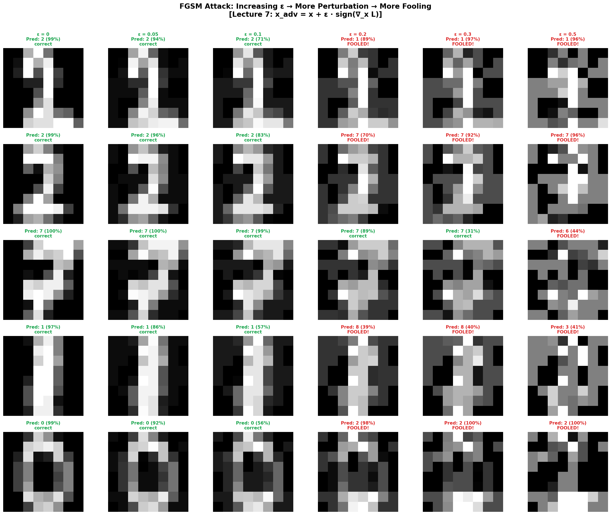
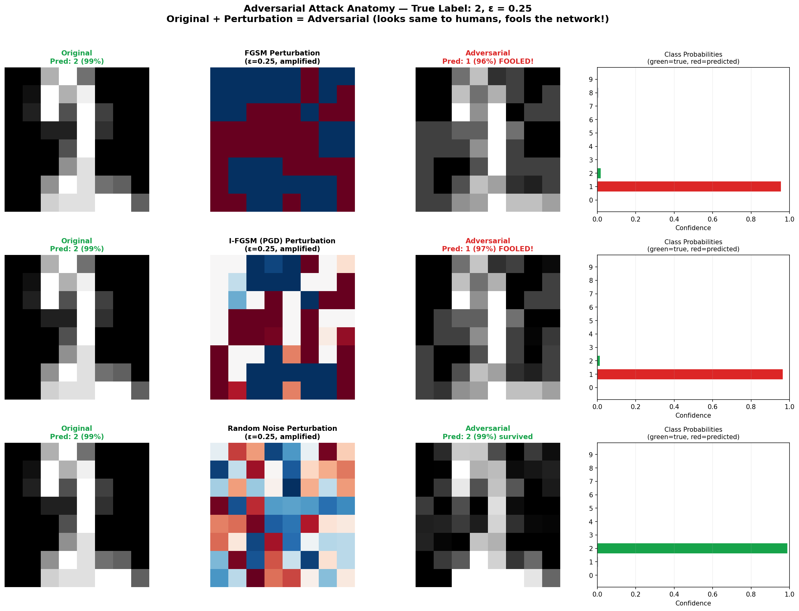
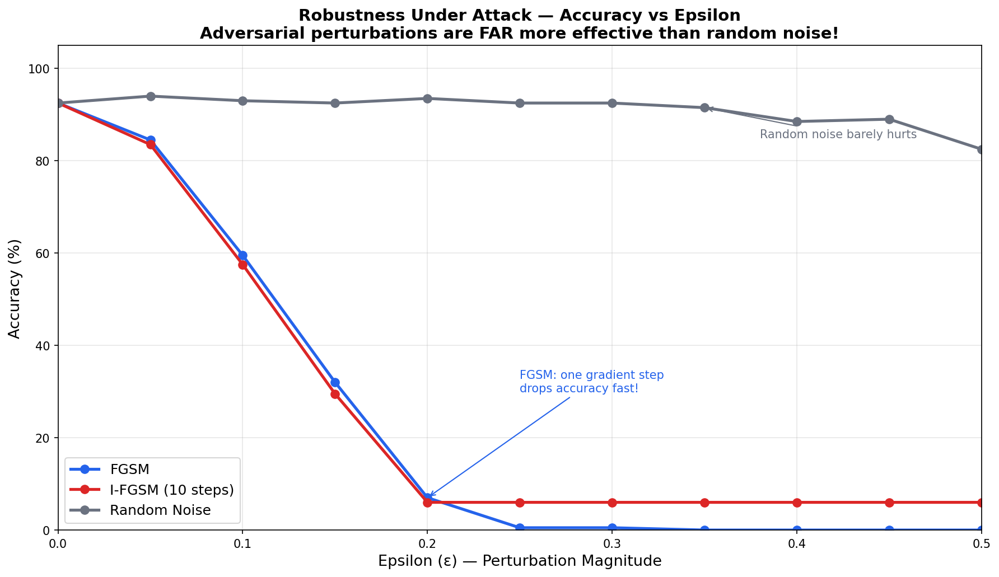
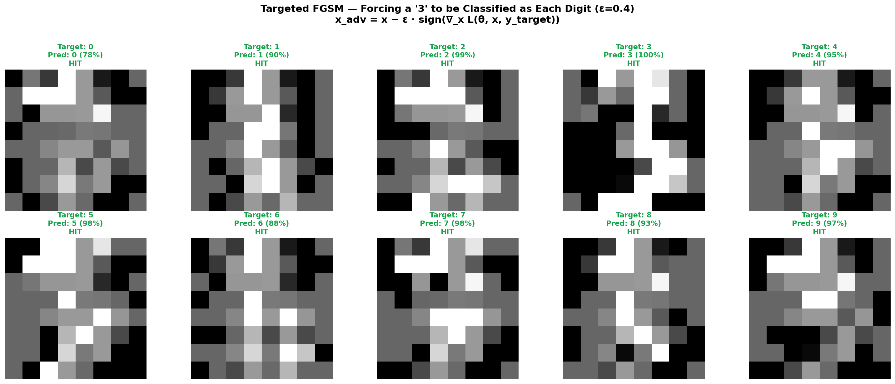
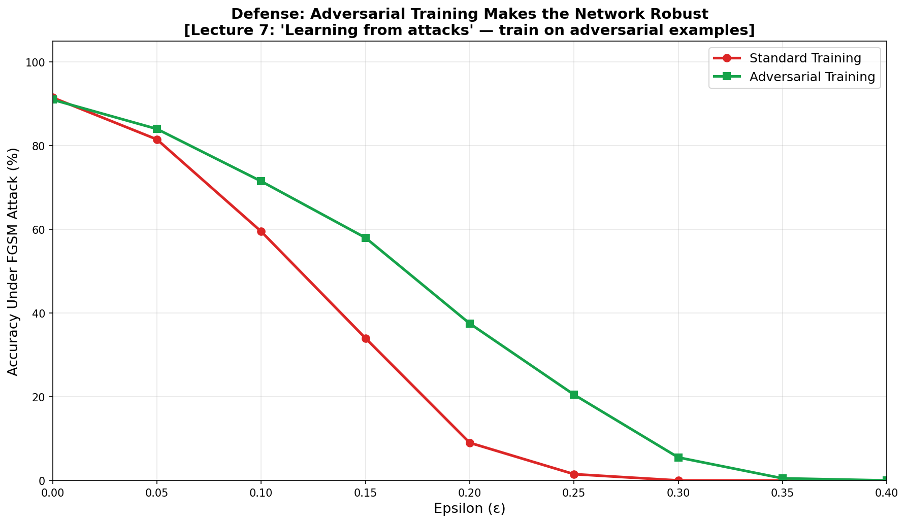

# 🎯 Adversarial Attack Demo — Fooling Neural Networks with FGSM

> **Imperceptible perturbations that make neural networks confidently wrong** — FGSM, Targeted FGSM, I-FGSM, and adversarial training, all implemented from scratch.

A single gradient step can drop accuracy from 95% to under 20%.

Built from **Advanced Machine Learning** at [TU Hamburg](https://www.tuhh.de) (Prof. Zemke, WS 2025/26, Lecture 7).

---

## 🔬 From Lecture 7

> *"Close to almost every successfully classified image are adversarial examples that a human cannot distinguish from the original, yet these are misclassified with high confidence."*

---

## 📊 Results

### FGSM: Increasing ε Fools the Network



### Attack Anatomy: Original + Perturbation = Adversarial



### Robustness Curve: Adversarial vs Random Noise



### Targeted Attack: Force Any Prediction



### Defense: Adversarial Training



---

## 📐 The Math

### FGSM (Goodfellow et al., 2014)

$$x_{adv} = x + \epsilon \cdot \text{sign}(\nabla_x L(\theta, x, y))$$

Normal training optimizes **weights** to minimize loss. FGSM optimizes the **input** to maximize loss. One gradient step is enough!

### Targeted FGSM

$$x_{adv} = x - \epsilon \cdot \text{sign}(\nabla_x L(\theta, x, y_{target}))$$

Minimize loss for the target class → network predicts the target.

### I-FGSM / PGD

$$x_{t+1} = \text{clip}(x_t + \alpha \cdot \text{sign}(\nabla_x L), \; x-\epsilon, \; x+\epsilon)$$

Repeat FGSM with small steps, projecting back to the ε-ball.

---

## 🗂️ Project Structure

```
10_adversarial_attacks/
├── README.md          ← You are here
├── attacks.py         ← FGSM, Targeted, I-FGSM, Random + SimpleNet
├── demo.py            ← Full demo with 5 visualizations
├── requirements.txt
└── figures/
```

## 🚀 Quick Start

```bash
cd 10_adversarial_attacks
pip install -r requirements.txt
python demo.py
```

---

## 📚 References

- Zemke, J.-P. M. — *AML Lecture 7: Understanding CNN & Adversarial Attacks*, TUHH WS 2025/26
- Goodfellow, Shlens & Szegedy — *Explaining and Harnessing Adversarial Examples* (FGSM), 2014
- Madry et al. — *Towards Deep Learning Models Resistant to Adversarial Attacks* (PGD), 2017
- Szegedy et al. — *Intriguing Properties of Neural Networks*, 2013

---

## 📜 License

MIT License

---

*Part of the [Advanced ML from Scratch](https://github.com/YOUR_USERNAME/advanced-ml-from-scratch) project series — Project 10 of 20.*
