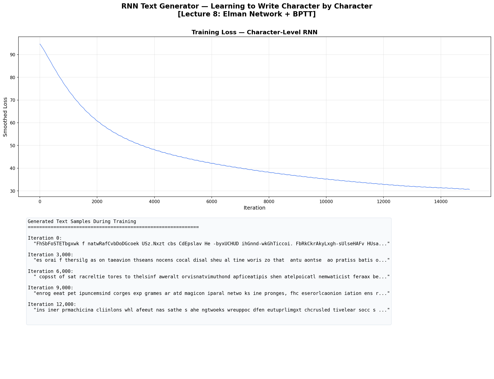
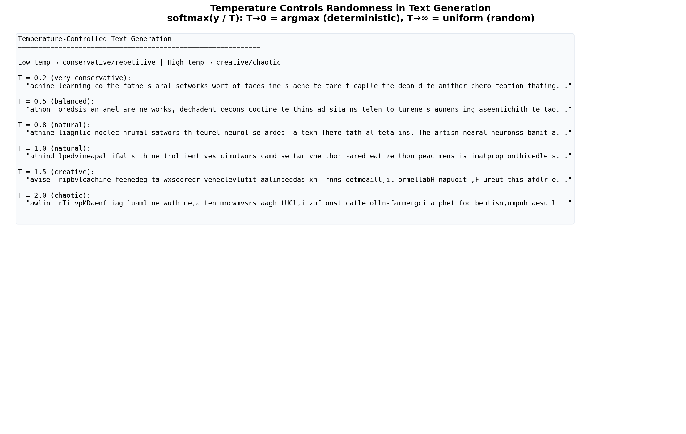
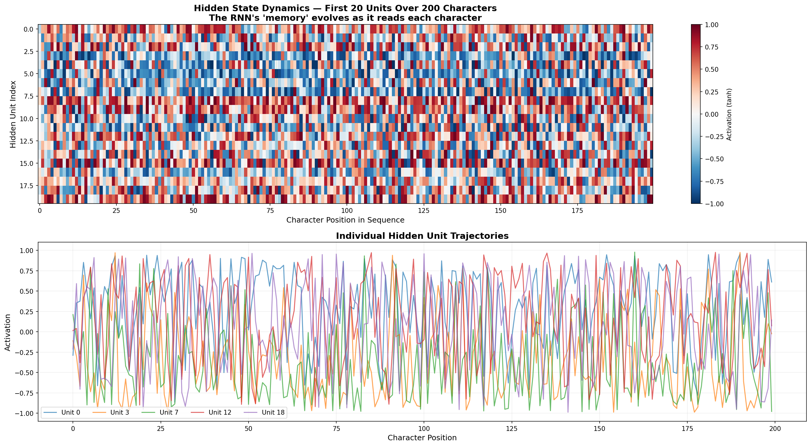

# 🔤 RNN Text Generator — Character-Level Language Model

> **A character-level Recurrent Neural Network that learns to write** — implemented from scratch as an Elman Network with BPTT, using only NumPy.

Feed it text, it learns character patterns, then generates new text in the same style.

Built from **Advanced Machine Learning** at [TU Hamburg](https://www.tuhh.de) (Prof. Zemke, WS 2025/26, Lecture 8).

---

## 📐 The Math (Lecture 8)

### Elman Network

$$h_t = \tanh(W_{hh} \cdot h_{t-1} + W_{hx} \cdot x_t + b_h)$$
$$y_t = \text{softmax}(W_{yh} \cdot h_t + b_y)$$

Where $h_t$ is the hidden state (memory), $x_t$ is the input character (one-hot), and $y_t$ is the predicted next character probability.

### Backpropagation Through Time (BPTT)

The RNN is "unrolled" through T time steps and standard backpropagation is applied. Gradients flow backwards through time — but vanish for long sequences (→ solved by LSTM in Lecture 9).

### Temperature-Controlled Sampling

$$p_i = \frac{e^{y_i / T}}{\sum_j e^{y_j / T}}$$

T → 0: deterministic (always picks most likely character). T → ∞: uniform random.

---

## 📊 Results

### Training Progress



### Temperature Comparison



### Hidden State Dynamics



---

## 🗂️ Project Structure

```
11_rnn_text_generator/
├── README.md        ← You are here
├── rnn.py           ← CharRNN class (Elman + BPTT)
├── train.py         ← Training + generation + plots
├── requirements.txt
└── figures/
```

## 🚀 Quick Start

```bash
cd 11_rnn_text_generator
pip install -r requirements.txt
python train.py
```

No external data needed — uses a built-in ML text corpus.

---

## 📚 Concepts Implemented

| Concept | Lecture | File |
|---------|---------|------|
| Elman Network (h_t = tanh(W·h + W·x + b)) | L8 | `rnn.py` |
| Hidden state as memory | L8 | `rnn.py → forward()` |
| BPTT (Backprop Through Time) | L8 | `rnn.py → backward()` |
| Gradient clipping | L8 | `rnn.py → backward()` |
| Temperature sampling | — | `rnn.py → sample()` |
| Adagrad optimizer | L3 | `rnn.py → update()` |

---

## 📚 References

- Zemke, J.-P. M. — *AML Lecture 8: Recurrent Neural Networks*, TUHH WS 2025/26
- Elman, J. — *Finding Structure in Time*, 1990
- Karpathy, A. — *The Unreasonable Effectiveness of RNNs*, 2015

---

## 📜 License

MIT License

---

*Part of the [Advanced ML from Scratch](https://github.com/YOUR_USERNAME/advanced-ml-from-scratch) project series — Project 11 of 20.*
