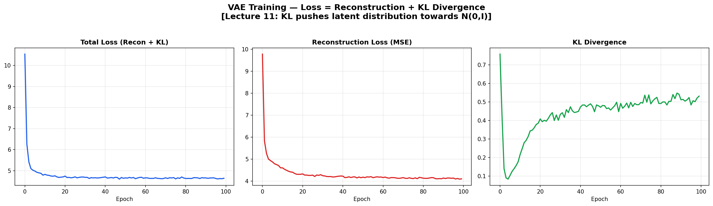
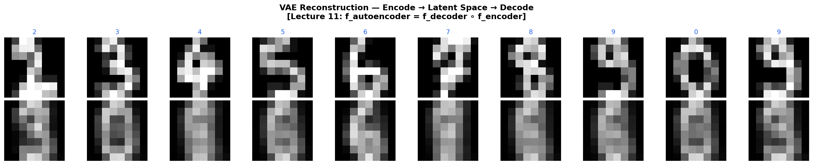
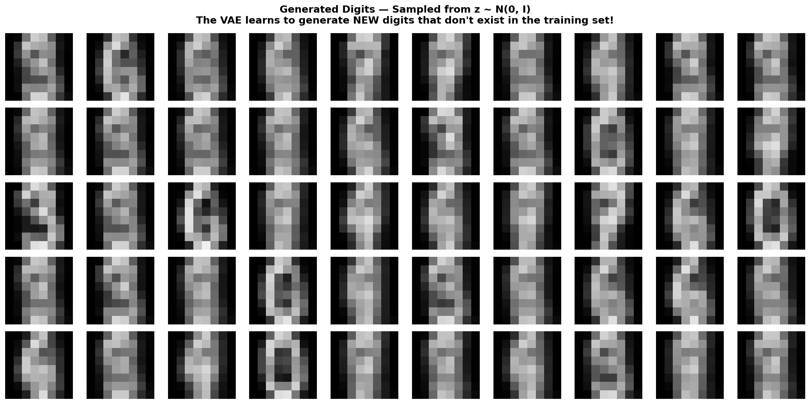
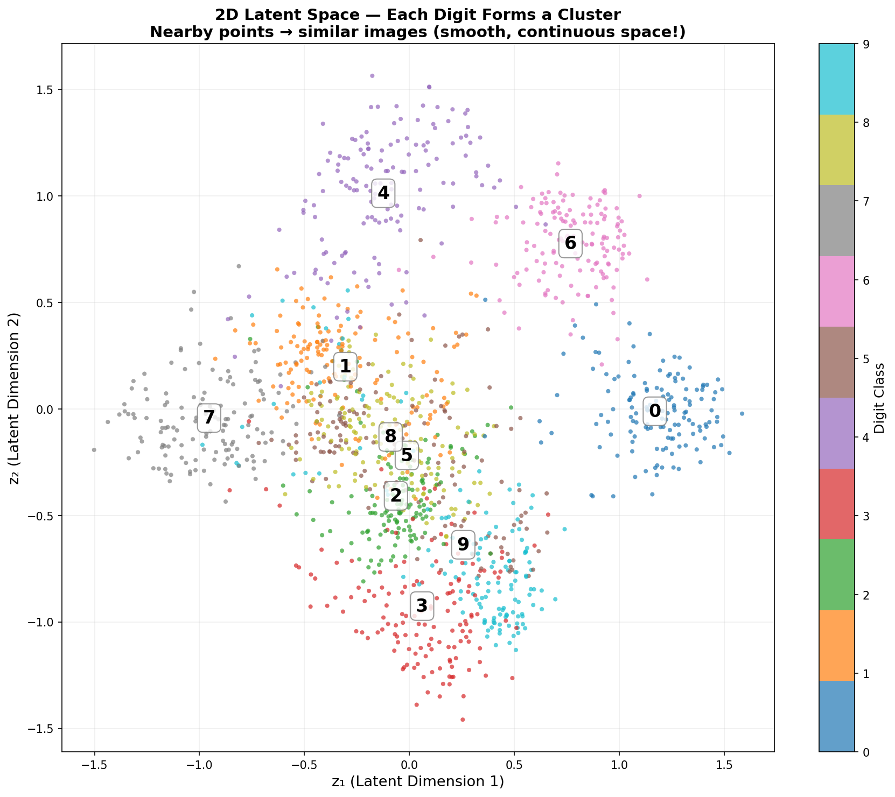
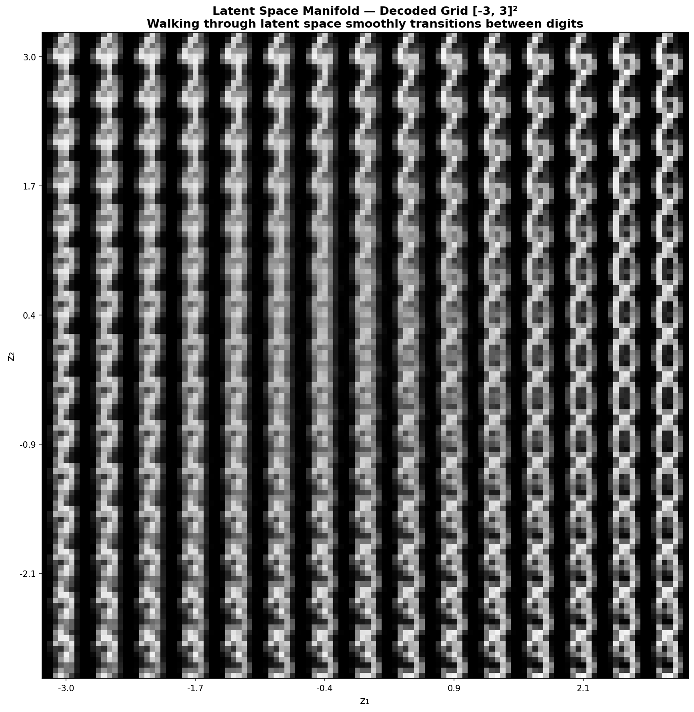
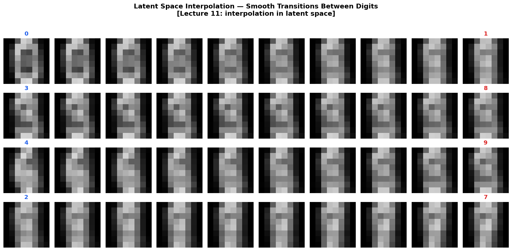

# 🎨 VAE Image Generator — Variational Autoencoder

> **Generate new handwritten digits by learning the latent space** — encoder, decoder, reparametrization trick, KL divergence, all from scratch in NumPy.

Explore a smooth 2D latent space where you can walk between digits and generate infinite new ones.

Built from **Advanced Machine Learning** at [TU Hamburg](https://www.tuhh.de) (Prof. Zemke, WS 2025/26, Lecture 11).

---

## 📐 The Math (Lecture 11)

### Autoencoder Architecture

$$f_{autoencoder} = f_{decoder} \circ f_{encoder}: \mathbb{R}^n \to \mathbb{R}^n$$

> *"Most autoencoders feature a layer with lower dimension m ≪ n that acts as a bottleneck."* — Lecture 11

### VAE Loss = Reconstruction + KL Divergence

$$\mathcal{L} = \underbrace{\|x - \hat{x}\|^2}_{\text{Reconstruction}} + \underbrace{-\frac{1}{2}\sum(1 + \log\sigma^2 - \mu^2 - \sigma^2)}_{\text{KL Divergence}}$$

### Reparametrization Trick

$$z = \mu + \sigma \cdot \epsilon, \quad \epsilon \sim \mathcal{N}(0, I)$$

This allows gradients to flow through the sampling step — without it, backpropagation would be impossible!

---

## 📊 Results

### Training Curves



### Reconstructions



### Generated New Digits (sampled from z ~ N(0,I))



### 2D Latent Space — Each Digit Forms a Cluster



### Latent Space Manifold — Walking Through the Decoded Grid



### Interpolation Between Digits in Latent Space



---

## 🗂️ Project Structure

```
16_vae_image_generator/
├── README.md        ← You are here
├── vae.py           ← Full VAE (Encoder + Decoder + Loss + Training)
├── train.py         ← Training + 6 visualizations
├── requirements.txt
└── figures/
```

## 🚀 Quick Start

```bash
cd 16_vae_image_generator
pip install -r requirements.txt
python train.py
```

No external data needed — uses sklearn digits (8×8).

---

## 📚 Concepts Implemented

| Concept | Lecture | File |
|---------|---------|------|
| Autoencoder: encoder + decoder | L11 | `vae.py` |
| Latent bottleneck (m ≪ n) | L11 | `vae.py` |
| Reparametrization trick z = μ + σ·ε | L11 | `vae.py → reparametrize()` |
| KL Divergence | L11 | `vae.py → loss()` |
| Latent space interpolation | L11 | `train.py → plot_interpolation()` |
| Bregman divergence (theory) | L11 | README |

---

## 📚 References

- Zemke, J.-P. M. — *AML Lecture 11: Autoencoder & GAN*, TUHH WS 2025/26
- Kingma & Welling — *Auto-Encoding Variational Bayes*, 2013
- Doersch — *Tutorial on Variational Autoencoders*, 2016

---

## 📜 License

MIT License

---

*Part of the [Advanced ML from Scratch](https://github.com/YOUR_USERNAME/advanced-ml-from-scratch) project series — Project 16 of 20.*
