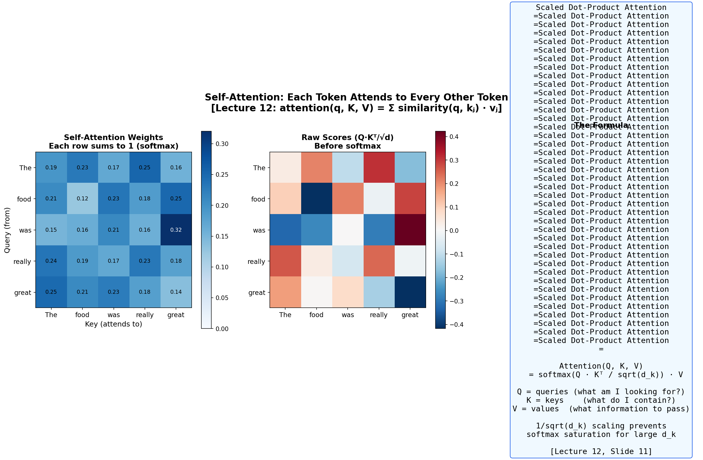
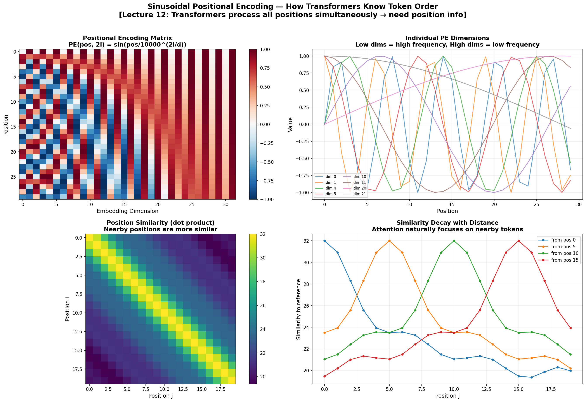
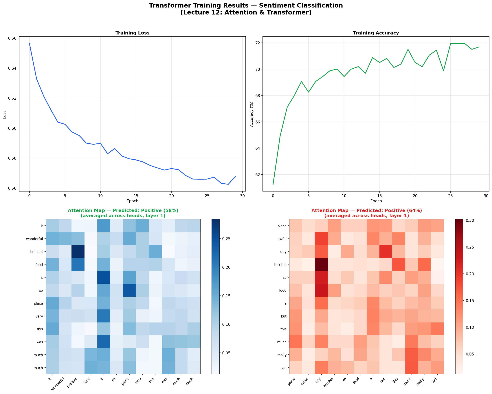
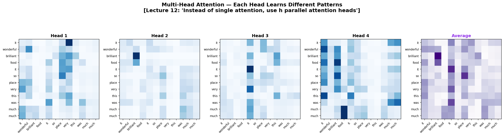

# 👑 Transformer from Scratch

> **The architecture that revolutionized AI** — Self-Attention, Multi-Head Attention, Positional Encoding, and the full Transformer Encoder, all implemented in pure NumPy.

Achieves sentiment classification by learning WHAT to attend to in each sentence.

Built from **Advanced Machine Learning** at [TU Hamburg](https://www.tuhh.de) (Prof. Zemke, WS 2025/26, Lecture 12).

---

## 📐 The Math (Lecture 12)

### Scaled Dot-Product Attention (Slide 11)

$$\text{Attention}(Q, K, V) = \text{softmax}\left(\frac{QK^T}{\sqrt{d_k}}\right) V$$

> *"attention(q, K, V) = Σⱼ similarity(q, kⱼ) · vⱼ where q 'query', k 'key', v 'value'"* — Lecture 12

### Multi-Head Attention (Slide 14)

$$\text{MultiHead}(Q, K, V) = \text{Concat}(\text{head}_1, \ldots, \text{head}_h) W^O$$
$$\text{where } \text{head}_i = \text{Attention}(QW_i^Q, KW_i^K, VW_i^V)$$

### Positional Encoding (Slide 17)

$$PE_{(pos, 2i)} = \sin(pos / 10000^{2i/d_{model}})$$
$$PE_{(pos, 2i+1)} = \cos(pos / 10000^{2i/d_{model}})$$

### Transformer Encoder Block

$$x \rightarrow \text{LayerNorm}(x + \text{MultiHeadAttention}(x, x, x)) \rightarrow \text{LayerNorm}(x + \text{FFN}(x))$$

---

## 📊 Results

### Self-Attention Explained



### Positional Encoding — How Transformers Know Token Order



### Training Results — Sentiment Classification



### Multi-Head Attention — Each Head Learns Different Patterns



---

## 🏗️ Architecture

```
Input tokens → Embedding (32-dim) → + Positional Encoding
  → TransformerEncoderBlock × 2:
      → Multi-Head Self-Attention (4 heads) + Residual + LayerNorm
      → Feed-Forward (32→64→32) + Residual + LayerNorm
  → Mean Pooling → Dense(32→2) → Softmax
```

---

## 🗂️ Project Structure

```
18_transformer_from_scratch/
├── README.md            ← You are here
├── transformer.py       ← Full Transformer (Attention + MHA + PE + Encoder)
├── train.py             ← Training + 4 visualizations
├── requirements.txt
└── figures/
```

## 🚀 Quick Start

```bash
cd 18_transformer_from_scratch
pip install -r requirements.txt
python train.py
```

No external data needed — generates synthetic sentiment data.

---

## 📚 Concepts Implemented

| Concept | Lecture | File |
|---------|---------|------|
| Scaled Dot-Product Attention | L12, Slide 11 | `transformer.py` |
| Multi-Head Attention | L12, Slide 14 | `transformer.py → MultiHeadAttention` |
| Positional Encoding (sinusoidal) | L12, Slide 17 | `transformer.py → positional_encoding()` |
| Layer Normalization | — | `transformer.py → LayerNorm` |
| Residual Connections | L10 | `transformer.py → TransformerEncoderBlock` |
| Feed-Forward Network | — | `transformer.py → FeedForward` |
| Full Encoder Block | L12, Slide 16 | `transformer.py → TransformerEncoderBlock` |

---

## 📚 References

- Zemke, J.-P. M. — *AML Lecture 12: Attention & Transformer*, TUHH WS 2025/26
- Vaswani et al. — *Attention Is All You Need*, NeurIPS 2017
- Bahdanau, Cho & Bengio — *Neural Machine Translation by Jointly Learning to Align and Translate*, 2014

---

## 📜 License

MIT License

---

*Part of the [Advanced ML from Scratch](https://github.com/YOUR_USERNAME/advanced-ml-from-scratch) project series — Project 18 of 20.*
