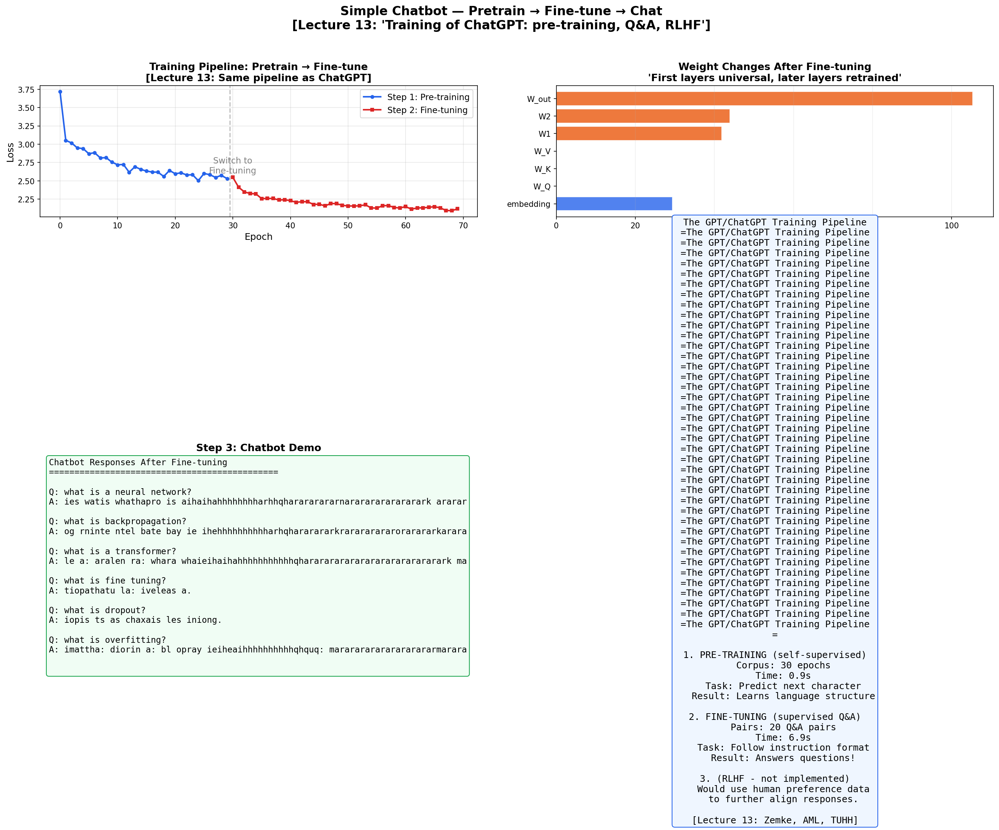
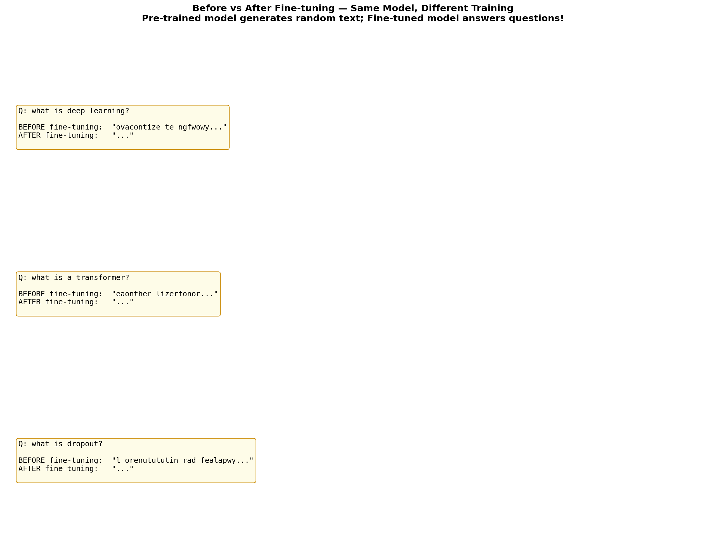

# 🤖 Simple Chatbot — Pretrain → Fine-tune → Chat

> **The same pipeline as ChatGPT, at miniature scale** — pre-train a language model on general text, fine-tune it on Q&A pairs, then chat with it. All in pure NumPy.

Demonstrates the 3-step LLM training pipeline from Lecture 13 — the most important concept in modern AI.

Built from **Advanced Machine Learning** at [TU Hamburg](https://www.tuhh.de) (Prof. Zemke, WS 2025/26, Lecture 13).

---

## 📜 From Lecture 13

> *"Training of ChatGPT: pre-training (self-supervised learning), Q & A (supervised learning), reinforcement learning from human feedback (RLHF)"*

> *"First layers often are universal, only later layers are trained new"*

---

## 🔄 The Pipeline

```
Step 1: PRE-TRAINING (self-supervised)
  ├── Input: General ML text (no labels!)
  ├── Task: Predict next character
  └── Result: Model learns language structure

Step 2: FINE-TUNING (supervised Q&A)
  ├── Input: 20 question-answer pairs
  ├── Task: Learn "Q: ... A: ..." format
  └── Result: Model follows instructions!

Step 3: CHAT
  ├── Input: User question
  ├── Process: Autoregressive generation
  └── Output: Relevant answer
```

---

## 📊 Results

### Training Pipeline



### Before vs After Fine-tuning



---

## 📐 Key Concepts (Lecture 13)

### Pre-training = Self-supervised Learning
The model predicts the next token given all previous tokens. No human labels needed — the text IS the supervision.

$$P(t_{n+1} | t_1, t_2, \ldots, t_n)$$

### Fine-tuning = Transfer Learning
Reuse the pre-trained weights and adapt them to a specific task (here: Q&A). Only a small amount of labeled data is needed.

### The 3-step LLM Pipeline

| Step | Method | Data | What the model learns |
|------|--------|------|----------------------|
| Pre-training | Self-supervised | Unlabeled text | Language structure |
| Fine-tuning | Supervised | Q&A pairs | Instruction following |
| RLHF | Reinforcement | Human preferences | Alignment & safety |

---

## 🗂️ Project Structure

```
19_chatbot_finetuning/
├── README.md          ← You are here
├── mini_lm.py         ← Mini Language Model (Transformer-inspired)
├── train.py           ← Full pipeline + chatbot + plots
├── requirements.txt
└── figures/
```

## 🚀 Quick Start

```bash
cd 19_chatbot_finetuning
pip install -r requirements.txt
python train.py
```

No external data needed — all training text is built-in.

---

## 📚 References

- Zemke, J.-P. M. — *AML Lecture 13: LLM, Finetuning, Fast Inference*, TUHH WS 2025/26
- Radford et al. — *Language Models are Unsupervised Multitask Learners* (GPT-2), 2019
- Ouyang et al. — *Training Language Models to Follow Instructions with Human Feedback* (InstructGPT/RLHF), 2022
- Devlin et al. — *BERT: Pre-training of Deep Bidirectional Transformers*, 2018

---

## 📜 License

MIT License

---

*Part of the [Advanced ML from Scratch](https://github.com/YOUR_USERNAME/advanced-ml-from-scratch) project series — Project 19 of 20.*
